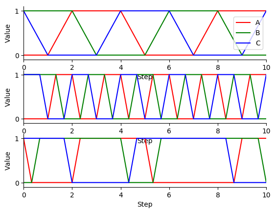

Mathematical representations and simulation algorithms
======================================================

There is wide range of mathematical representations that can be used model cells, ranging from coarse-grained representations such as Boolean networks to fine-grained representations such as spatial stochastic models. Below are several considerations for choosing a mathematical representation for a model.

* What is the model's purpose? What properties of the cell are being analyzed by the model?
* What are the relevant physical scales of the biology? Deterministic models are valid approximations when the fluctuations are small which often occurs when the flux scale is large. Conversely, stochastic models should be used when the fluctuations are large and/or they critically impact behavior.
* How much information is known about the biology? If significant information is known, then fine-grained models are possible. Conversely, if the biology is not well-characterized a fine-grained representation may be infeasible and a coarse-grained representation should be used.
* How much computational cost is acceptable? If you need a model to execute quickly or you anticipate running large numbers of simulations, it may be best to use a coarse-grained representation. Alternatively, if you want to build the most detailed model possible, you should use a fine-grained representation.
* What simulation software tools are available? Several tools are available to simulate single-algorithm models. However, there are few tools for simulating hybrid models. If you don't want to spend a lot of energy writing numerical simulation code, we recommend you focus on well-established mathematical representations.

The goal of this tutorial is to introduce you to the most common mathematical representations, simulation algorithms, simulation experiment description formats, and simulation software programs for cell modeling. In addition, this tutorial will highlight the advantages and disadvantages of each method and tool, particularly for large-scale modeling.

Boolean/logical models
----------------------
Boolean models are composed of composed Boolean variables and logical functions which describe how the value of each variable is influenced by other variables. Logical or multi-level models are a generalization of Boolean models in which the variables can have two or more possible values. Importantly, Boolean models have no quantitative parameters or explicit timescales. Similarly, logical models have few quantitative parameters. Consequently, Boolean and logical models are often used to describe biological systems that have not yet been quantitatively characterized, as well as to build large models that contain many more variables/species and functions/interactions than could be calibrated in a more quantitative model.

Boolean models are simulated with timestep algorithms which divide simulations into many small timesteps during which the logical functions are evaluated and the Boolean variables are updated according to a specific *update scheme*. Below are some of the most commonly used update schemes:

* Synchronous updating: during each timestep, all of the functions are evaluated with the same node states and all of the nodes are updated with the results of the functions
* Asynchronous updating: during each timestep, only one or a subset of the logical functions are evaluated and only the corresponding subset of nodes are updated

    * Deterministic asynchronous updating: the timesteps iterate over the functions/rules in a deterministic order
    * Random asynchronous updating: at each timestep, the simulator randomly chooses one or more functions/nodes to update

There are also several generalizations of Boolean and logical-valued models including probabilistic Boolean models that describe each variable as a probability and temporal Boolean models that have explicit time scales.

Ordinary differential equations (ODEs)
--------------------------------------
Ordinary differential equations (ODEs) is one of the most commonly used approaches for modeling dynamical systems. ODE models are based on microscopic analyses of how the concentration of each species in the cell changes over time in response to the concentrations of other species. Because ODE assume that cells are well-mixed and that they behave deterministically, ODE models are most appropriate for small systems that involve large concentrations and high fluxes.

ODE models can be simulated by numerically integrating the differential equations. The most basic ODE integration method is Euler's method. Euler's method is a time stepped algorithm in which the next state is computed by adding the current state and the multiplication of the current differentials with the timestep.

.. math::

    y(t+\Delta t) = y(t) + \Delta t \frac{dy}{dt}

Euler's method estimates :math:`y(t+\Delta t)` using a first-order approximation. ODE models can be simulated more accurately using higher order estimates, or Taylor series, of :math:`y(t+\Delta t)`. One of the most popular algorithms which implements this approach is the Runge-Kutta 4th order method. Yet more advanced integration methods select the time step adaptively. Some of the most sophisticated ODE integration packages include ODEPACK (lsoda) and Sundials (vode). These packages can be used in Python via scipy's integrate module.

Stochastic simulation
---------------------
Like ODE models, stochastic models are based on microscopic analyses of how the concentration of each species in the cell changes over time in response to the concentrations of other species. However, stochastic simulation algorithms relax the assumption that cells behave deterministically. Instead, stochastic simulation algorithms assume that the rate of each reaction is Poisson-distributed. As a result, stochastic simulation algorithms generate sequences of reaction events at which the simulated state discretely changes.

Stochastic simulation should be used to model systems that are sensitive to small fluctuations such as systems that involve small concentrations and small fluxes. However, stochastic simulation can be computationally expensive for large numbers due to the needs to resolve the exact order of every reaction and the need to run multiple simulations to sample the distribution of predicted cell behaviors.

Because stochastic simulations are random, stochastic models should generally be simulated multiple times to sample the distribution of predicted cell behaviors. In general, these simulations should be run both using different random number generator seeds and different random initial conditions.

Gillespie Algorithm / Stochastic Simulation Algorithm / Direct Method
^^^^^^^^^^^^^^^^^^^^^^^^^^^^^^^^^^^^^^^^^^^^^^^^^^^^^^^^^^^^^^^^^^^^^
The simplest way to stochastically simulate a model is to iteratively

#. Calculate the instantaneous rate of each reaction, :math:`p`, also known as the reaction `propensities`
#. Sum these rates
#. Sample the time to the next reaction by sampling from a exponential distribution with parameter :math:`1/\sum{p}` by utilizing these mathematical facts

    * The sum of independent Poisson processes with parameters :math:`\lambda_1` and :math:`\lambda_2` is a Poisson process with parameter :math:`\lambda = \lambda_1 + \lambda_2`, and
    * The time to the next event of a Poisson is exponentially distributed with parameter :math:`1/\lambda`.

#. Sample the next reaction from a multinomial distribution with parameter :math:`p/\sum{p}` equal to the condition probability that each reaction fires given that a reaction fires.

Below is pseudo-code for this algorithm which is also known as the Gillespie algorithm, the Stochastic Simulation Algorithm (SSA), and the direct method::

    import numpy

    # represent the reaction and rate laws of the model
    reaction_stochiometries = numpy.array([ ... ])
    kinetic_laws = [...]

    # initialize the time and cell state
    time = 0
    copy_numbers = numpy.array([ ... ])

    while time < time_max:
        # calculate reaction properties/rates
        propensities = [kinetic_law(copy_numbers) for kinetic_law in kinetic_laws]
        total_propensity = sum(propensities)

        # select the length of the time step from an exponential distributuon
        dt = numpy.random.exponential(1 / total_propensity)

        # select the next reaction to fire
        i_reaction = numpy.random.choice(len(propensities), p=propensities / total_propensity)

        # reject the selected reaction if there are insufficient copies of the reactants for the reaction

        # update the time and cell state based on the selected reaction
        time += dt
        copy_numbers += reaction_stochiometries[:, i_reaction]

Gillespie first reaction method
^^^^^^^^^^^^^^^^^^^^^^^^^^^^^^^
Rather than sampling the time to the next reaction and then selecting the next reaction, alternatively we can stochastically simulate a model by (1) sampling the putative time to the next firing of each reaction and (b) firing the reaction with the minimum putative next reaction time. This algorithm is mathematically equivalent to the Gillespie algorithm. However, it is slower than the Gillespie algorithm because it draws more random number samples during each iteration.::

    import numpy

    # represent the reaction and rate laws of the model
    reaction_stochiometries = numpy.array([ ... ])
    kinetic_laws = [...]

    # initialize the time and cell state
    time = 0
    copy_numbers = numpy.array([ ... ])

    while time < time_max:
        # calculate reaction properties/rates
        propensities = [kinetic_law(copy_numbers) for kinetic_law in kinetic_laws]

        # calculate putative next reaction times for each reaction
        dt = numpy.random.exponential(1 / propensities)

        # select the next reaction to fire
        i_reaction = numpy.argmin(dt)

        # reject the selected reaction if there are insufficient copies of the reactants for the reaction

        # update the time and cell state based on the selected reaction
        time += dt[i_reaction]
        copy_numbers += reaction_stochiometries[:, i_reaction]

Gibson-Bruck next reaction method
^^^^^^^^^^^^^^^^^^^^^^^^^^^^^^^^^^
`The Gibson-Bruck first reaction method <http://doi.org/10.1021/jp993732q>`_ is a computational optimization of the Gillespie first reaction method which uses (a) a dependency graph to only recalculate rate laws and resample putative next reaction times when necessary, namely when the participants in the rate law are updated and (b) an `indexed priority queue` to minimize the computational cost of identifying the reaction with the lowest putative next reaction time and updating the data structure which stores these putative next reaction times.

An indexed priority queue is a data structure that provides efficient identification (:math:`O(1)`) of the minimum value of the list and efficient updating of the list (:math:`O(\log{n})`. Indexed priority queues are implemented by the Python ``pqdict`` package. See the `pqdict documentation <http://pqdict.readthedocs.io/en/latest/intro.html#what-is-an-indexed-priority-queue>`_ for more information about indexed priority queues.

Note, the Gibson-Bruck first reaction method is mathematically equivalent to the Gillespie direct and Gillespie first reaction methods.

Below is pseudo code for the Gibson-Bruck next reaction method::

    import numpy
    import pqdict

    # represent the reaction and rate laws of the model
    reaction_stochiometries = numpy.array([ ... ])
    kinetic_laws = [...]

    # represent the dependency of the kinetic laws on the species
    dependency_graph = numpy.array([...])

    # initialize the time and cell state
    time = 0
    copy_numbers = numpy.array([ ... ])

    # calculate reaction properties/rates
    propensities = [kinetic_law(copy_numbers) for kinetic_law in kinetic_laws]

    # calculate putative next reaction times for each reaction
    dt = pqdict.pqdict( ... numpy.random.exponential(1 / propensities) ... )

    while time < time_max:
        # select the next reaction to fire
        i_reaction = numpy.argmin(dt)

        # reject the selected reaction if there are insufficient copies of the reactants for the reaction

        # update the time and cell state based on the selected reaction
        time += dt[i_reaction]
        copy_numbers += reaction_stochiometries[:, i_reaction]

        chosen_dt = dt[i_reaction]
        for species in reaction_stochiometries[:, i_reaction]:
            for reaction in dependency_graph[:, species]:
                old_propensity = propensities[reaction]
                propensities[reaction] = kinetic_laws[reaction]
                if reaction == i_reaction:
                    dt[reaction] = numpy.random.exponential(1 / propensities[reaction])
                else:
                    dt[reaction] = old_propensity / propensities[reaction] * (dt[reaction] - chosen_dt)

Tau-leaping
^^^^^^^^^^^
In addition to the Gillespie algorithm, the Gillespie first reaction method, and the Gibson-Bruck method, there are many algorithms which approximate their results with significantly lower computational costs. One of the most common of these approximate simulation algorithms is the `tau-leaping algorithm <https://en.wikipedia.org/wiki/Tau-leaping>`_. The tau-leaping algorithm is a time-stepped algorithm similar to Euler's method which samples the number of firings of each reaction from a Poisson distribution with lambda equal to the product of the propensity of each reaction and the time step. Below is pseudocode for the tau-leaping algorithm::

    # represent the reaction and rate laws of the model
    reaction_stochiometries = numpy.array([ ... ])
    kinetic_laws = [...]

    # select the desired time step
    dt = 1

    # initialize the simulated state
    time = 0
    copy_numbers = numpy.array([...])

    # iterate over time
    while time < time_max:
        # calculate the rate of each reaction
        propensities = [kinetic_law(copy_numbers) for kinetic_law in kinetic_laws]

        # sample the number of firings of each reaction
        n_reactions = numpy.random.poisson(propensities * dt)

        # adjust the time step or reject reactions for which there are insufficient reactants

        # advance the time and copy numbers
        time += dt
        copy_numbers += reaction_stochiometries * n_reactions

The tau-leaping algorithm can be improved by adaptively optimizing time step based on its sensitivity to the propensities:

.. math::

    g_i &= -\min_j { S_{ij} } \\
    \mu_i &= \sum_j { S_{ij} R_j (x) } \\
    \sigma_i^2 &= \sum_j { S_{ij}^2 R_j (x) } \\
    dt &= \min_i { \left\{
            \frac{
                \max{ \left\{
                    \epsilon x_i / g_i, 1
                \right\} }
            }{
            |\mu_i (x)|
            }  ,
            \frac{
                \max { \left\{
                    \epsilon x_i / g_i, 1
                \right\} }^2
            }{
            \sigma_i^2
            }
        \right\} } \\

where :math:`x_i` is the copy number of species :math:`i`, :math:`S_{ij}` is the stoichiometry of species :math:`i` in reaction :math:`j`, :math:`R_j (x)` is the rate law for reaction :math:`j`, and :math:`\epsilon \approx 0.03` is the desired tolerance. See `Cao, 2006 <http://doi.org/10.1063/1.2159468>`_ for more information.

Network-free simulation
-----------------------
Network-free simulation is a variant of stochastic simulation for simulating rule-based models in which the occupied species and active reactions are discovered dynamically during simulation rather than statistically enumerating all possible species and reactions prior to simulation. Network-free simulation is a mathematically equivalent algorithm for stochastic simulation. The key advantage of network-free simulation is that it can simulate models with very large or infinitely large state state spaces that cannot be simulated with conventional simulation algorithms.

Flux balance analysis (FBA)
---------------------------
Flux balance analysis (FBA) is a popular approach for simulating metabolism. Like ODE models, FBA is based on microscopic analyses of how the concentration of each species in the cell changes over time in response to the concentrations of other species. However, unlike ODE models which assume that each reaction can be annotated with a rate law, FBA does not assume that rate laws can be determined but does assume that cells have evolved to maximize their growth rates. In addition, FBA assumes that all species are at steady-state (:math:`\frac{dx}{dt} = 0`), which greatly constrains the model, thereby reducing the amount of data needed. However, this assumption also prevents FBA from making predictions about the dynamics of metabolic networks.

Together, these assumptions enable FBA to determine reaction fluxes by posing an optimization problem that maximizes growth. To achieve this, FBA leverages two additional sets of data. First, it incorporates estimates of the minimum and maximum possible flux of each reaction which, for a subset of reactions, can be obtained from experimental observations. These constrain the optimization solution space.
Second, FBA expresses the growth of a cell via an additional pseudo-reaction called the biomass reaction that represents the assembly of metabolites into the molecules which are incorporated in the growth of a cell. It can be calibrated based on the observed cellular composition. Together, these assumptions and additional data enable FBA to pose cell simulation as a linear optimization problem that can be solved with linear programming.

.. math::

    \text{Maximize}~ v_\text{growth} &= f' v \\
    \text{Subject to}~\\
    S v &= 0 \\
    v^\text{min} &\leq v \leq v^\text{max}, \\

where :math:`v_j` is the flux of reaction :math:`j`, :math:`f_\mu` is 1 for the biomass reaction and 0 otherwise, :math:`S_{ij}` is the stoichiometry of species :math:`i` in reaction :math:`j`, and :math:`v^\text{min}_{j}` and :math:`v^\text{max}_j` are the upper and lower bounds of the flux of reaction :math:`j`.

In addition, there are a variety of generalizations of FBA for using genomic and other experimental data to generate more accurate flux bounds (see `review <https://doi.org/10.1371/journal.pcbi.1003580>`_), and combined regulatory and FBA metabolism simulations (`rFBA <http://doi.org/10.1038/nature02456>`_, `PROM <http://doi.org/10.1073/pnas.1005139107>`_).

.. todo: discuss how extracellular concentrations can be incorporated in FBA models

Dynamic FBA simulations (dFBA) enables dynamic models of metabolism by (1) assuming that cells quickly reach pseudo-steady states with their environment because their internal dynamics are significantly faster than that of the external environment, (2) iteratively forming and solving FBA models, and (3) updating the extracellular concentrations based on the predicted fluxes. Below is pseudo-code for dFBA::

    Set the initial biomass concentration
    Set the initial conditions of the environment
    From the starting time to the final time
        Based on the current biomass concentration and environmental conditions,
            set the upper and lower bounds of the exchange reactions
        Solve for the maximum growth rate and optimal fluxes
        Update the biomass concentration based on the predicted growth rate
        Update the environmental conditions based on the predicted exchange fluxes

Hybrid/multi-algorithmic simulation
-----------------------------------
A hybrid or multi-algorithmic simulation is a co-simulation of multiple submodels which employ multiple simulation algorithms. For example, a model may contain a metabolism submodel integrated with the dFBA algorithm and transcription, translation and degradation submodels integrated with the stochastic simulation algorithm (SSA).
Hybrid simulation often requires combining and synchronizing of discrete and continuous submodels that contain discrete and continuous variables. For example, a hybrid simulation could co-simulate a discrete stochastic submodel that uses the stochastic simulation algorithm and a deterministic continuous submodel that uses the Runge-Kutta 4th order method.

Hybrid simulation is a powerful strategy for managing heterogeneity in the scales of the model system, heterogeneity in a modeler's interest in specific aspects of the model system, heterogeneity in the amount of knowledge of specific aspects of the model system, and heterogeneous model design decisions among multiple collaborating modelers:

* Hybrid simulation can enable efficient simulation of models that span a range of scales, including low-concentration components whose dynamics are highly variable and high-concentration components whose dynamics exhibit little variation. In this case, the modeler or hybrid simulation algorithm selects the most appropriate simulation algorithm for each model component to optimize the trade off between computational accuracy and cost. Specifically, the simulator partitions the species and reactions into two or more submodels that partition species by their concentration ranges. For more information, we recommend reading recent papers about partitioned and slow-scale tau-leaping.
* Hybrid simulation can enable model components to be described with different resolutions either due to different levels of interest or prior knowledge about specific aspects of the model system. For example, hybrid simulation could be used to simultaneously but separately represent the known stochastic behavior of transcription and the known steady-state behavior of metabolism. In this case, a modeler would select SSA to represent transcription and dFBA to represent metabolism.
* Hybrid simulation can make it easier for modelers to build the submodels of a large model in parallel. Multiple collaborating investigators may independently develop submodel components of the full model, make mathematically different design decisions for their independent submodels, and separately calibrate and verify their submodels. Hybrid simulation can then simulate the entire large model.

Approaches to constructing hybrid simulations
^^^^^^^^^^^^^^^^^^^^^^^^^^^^^^^^^^^^^^^^^^^^^
Broadly, there are two ways to construct hybrid simulations:

* Hybrid simulations can be designed by the modeler(s) to maximize the utility of the model. In this case, the modeler(s) use their expert knowledge to assign each component of the model to a specific simulation algorithm. Examples of hybrid simulations that have been designed by modelers include `integrated flux balance analysis (iFBA) <http://doi.org/10.1093/bioinformatics/btn352>`_ and `regulatory flux balance analysis (rFBA) <http://doi.org/10.1038/nature02456>`_
* Hybrid simulations can be structured by the simulation software to optimize the tradeoff between prediction accuracy and computational cost. In this case, the simulator automatically partitions the model into algorithmically-distinct submodels. Examples of hybrid simulations that are chosen by simulation software systems include `partitioned tau-leaping <https://doi.org/10.1063/1.2354085>`_ and `slow scale tau-leaping <https://dx.doi.org/10.1016%2Fj.cma.2008.02.024>`_.

Numerical simulation
^^^^^^^^^^^^^^^^^^^^
Hybrid simulation algorithms concurrently integrate a model's component submodels. One approach iterates over many small time steps and alternately integrates the submodels and synchronizes their states. To simplify this problem, submodels that should be simulated with the same simulation algorithm can first be analytically merged, thereby reducing the number of submodels that must be concurrently integrated. Thus, hybrid simulation broadly requires two steps:

#. Analytically merge all of the algorithmically-like submodels
#. Co-simulate or concurrently integrate the merged submodels

The goal of hybrid simulation is to represent the shared state and dynamics of a model composed of multiple submodels. Since submodels that employ different simulation algorithms must be integrated separately, achieving this goal requires that a hybrid simulator synchronize the execution of different submodels and exchange shared state among the submodels.

Below, we summarize several increasingly sophisticated hybrid simulation algorithms:

* Serial simulation: A global cell state is initialized at time 0. Divide the simulation of a cell into multiple small time steps. Within each time step, sequentially simulate all submodels. Each submodel transfers its local state updates to the global cell state. Optionally, randomize the order in which submodels are simulated within a time step. However, this algorithm introduces inaccuracies because it violates the arrow of time by integrating submodels based on different states within each time step.
* Partitioning and merging: Divide the simulation into multiple small time steps. With each time step, partition the pool of each species into separate pools for each submodel. Simulate the submodels independently using the independent pools. Update the global species pools by merging the submodel pools. Species can be partitioned uniformly, based on their utilization during the previous time point, or based on a preliminary integration of the submodels. This is a relatively simple algorithm to implement for models whose state only represents concentrations and/or species copy number. However, it can be challenging to partition and merge rule-based models whose states are represented by graphs.
* Interpolation: For models that are composed of one discrete and one continuous model, we can append the continuous model to the discrete model as a single pseudo reaction, fire the reaction immediately after each discrete reaction, and periodically calculate the coefficients of the pseudo reaction by numerically integrating the continuous model. Furthermore, we could adaptive choose the frequency at which the continuous model is simulated based on the sensitivity of its predictions to its inputs from the discrete model. Overall, we believe this algorithm provides a good balance of accuracy and speed.
* Scheduling: Build a higher-order stochastic model which contains one pseudo-reaction per submodel. Set the propensity of each pseudo-reaction to the total propensity of the submodel. Use the Gillespie method to schedule the firing of the pseudo-reactions/submodels. This is the strategy used by E-Cell (Takahashi et al., 2004).
* Upscaling: For models that are composed of one discrete and one continuous model, we can append all of the continuous reactions model to the discrete model; periodically set their propensities by evaluating their kinetic laws, or in the case of FBA, calculating the optimal flux distribution; and select and fire the continuous reactions using the same mechanism as the discrete reactions. This algorithm is compelling, but is computationally expensive due to the need to resolve the order of every reaction including every continuous reaction.

Synchronizing discrete and continuous variables
^^^^^^^^^^^^^^^^^^^^^^^^^^^^^^^^^^^^^^^^^^^^^^^
Synchronizing discrete and continuous models can require rounding continuous variables and/or rates. In such cases, we recommend stochastically rounding the decimal portion of each the continuous-valued rate, weighted by the decimal portion of the rate. This method has the following advantages over other potential methods:

* This method will not prevent models from reaching rare states unlike deterministic rounding which will deterministically round down small probabilities.
* This method satisfies mass, atom, and charge balance unlike rounding the values of the model variables.
* This method will only inject a small amount of stochastic variation into the model unlike other potential stochastic rounding schemes such as Poisson-distributed random rounding.

See `Vasudeva et al., 2003 <http://doi.org/10.1093/bioinformatics/btg376>`_ for additional discussion about rounding continuous quantities for synchronization with discrete quantities.

Simulating individual submodels
^^^^^^^^^^^^^^^^^^^^^^^^^^^^^^^
For calibration and testing, it is useful to simulate individual submodels of a larger model. To meaningfully simulate a submodel, you must `mock` the impact of all of the other submodels that the submodel interacts with. This can be done by creating coarse-grained versions of all of the other submodels which mimic their external behavior at a lower computational cost.

Reproducing stochastic simulations
----------------------------------
To run stochastic simulations reproducibly, every simulation input must be identical, including the order in which the reactions are defined and the state of the random number generator.

The state of the ``numpy`` random number generator can be set using the ``seed`` method::

    numpy.random.seed(0)

Simulation descriptions
-----------------------
To simulate a model, we must specify every aspect of the simulation including

* The model that we want to simulate
* Any modifications of the model that we wish to simulate (e.g. modified parameter values)
* The initial conditions of the simulation
* The desired simulation algorithm
* The parameters of the simulation algorithm such as the initial seed and state of the random number generator

The `Simulation Experiment Description Markup Language <http://sed-ml.org>`_ (SED-ML) is one of the most commonly used languages for describing simulations. SED-ML is primarily designed to describe simulations of XML-based models such as models encoded in CellML and SBML. However, SED-ML can be used to describe the simulation of any model. `Simulation Experiment Specification via a Scala Layer <http://sessl.org>`_ (SESSL) is competing language simulation description language.

Software tools
--------------
Below is a list of some of the most commonly used simulation software programs for cell modeling:

* Desktop programs:

    * `CellNOpt <http://www.cellnopt.org/>`_: Boolean simulator
    * `COPASI <http://copasi.org>`_: ODE and stochastic simulator
    * `ECell <http://www.e-cell.org>`_: multi-algorithmic simulator
    * `iBioSim <http://www.async.ece.utah.edu/ibiosim>`_
    * `NFSim <http://michaelsneddon.net/nfsim/>`_: stochastic network-free simulator
    * `VCell <http://vcell.org/>`_: ODE, stochastic, and spatial simulator

* Web-based programs

    * `Cell Collective <https://cellcollective.org>`_: online Boolean simulator
    * `JWS Online <http://jjj.biochem.sun.ac.za/>`_: online ODE and stochastic simulator

* Python libraries

    * `BooleanNet <https://github.com/ialbert/booleannet>`_: Boolean simulation
    * `COBRApy <https://opencobra.github.io/>`_: FBA simulation
    * `libRoadRunner <http://libroadrunner.org/>`_: ODE simulation
    * `LibSBMLSim <http://fun.bio.keio.ac.jp/software/libsbmlsim/>`_: ODE simulation
    * `PySB <http://pysb.org/>`_: rule-based simulation
    * `StochPy <http://pythonhosted.org/StochPy/>`_: stochastic simulation

Exercises
---------

Required software
^^^^^^^^^^^^^^^^^
For Ubuntu, the following commands can be used to install all of the software required for the exercises::

    sudo apt-get install \
        python \
        python-pip
    sudo pip install \
        matplotlib \
        numpy \
        optlang \
        scipy

Boolean simulation
^^^^^^^^^^^^^^^^^^
In this exercise we will simulate the gene Boolean network shown below using both synchronous and asynchronous updating.

.. image:: boolean-model.png

First, define a set of functions which represent the edges of the network::

    regulatory_functions = {
        'A': lambda nodes: not nodes['C'],
        'B': lambda nodes: not nodes['A'],
        'C': lambda nodes: not nodes['B'],
    }

Second, define the initial state of the network::

    initial_state = {
        'A': False,
        'B': True,
        'C': True
    }

Third, write a Boolean simulator and synchronous, asynchronous deterministic, and asynchronous random update schemes by completing the code fragments below::

    def simulate(regulatory_functions, initial_state, n_steps, update_scheme):
        """ Simulates a Boolean network for :obj:`n_steps` using :obj:`update_scheme`

        Args:
            regulatory_functions (:obj:`dict` of :obj:`str`, :obj:`function`): dictionary of regulatory functions for each species
            initial_state (:obj:`dict` of :obj:`str`, :obj:`bool`): dictionary of initial values of each species
            n_steps (:obj:`int`): number of steps to simulate
            update_scheme (:obj:`method`): update schema

        Returns:
            :obj:`tuple`:

                * :obj:`numpy.ndarray`: array of step numbers
                * :obj:`dict` of :obj:`str`, :obj:`numpy.ndarray`: dictionary of histories of each species
        """

        # initialize data structures to store predicted time course and copy initial state to state history
        ...

        # set current state to initial state
        ...

        # iterate over time steps
        for step in range(1, n_steps + 1):
            # update state according to :obj:`update_scheme`
            ...

            # store current value
            ...

        # return predicted dynamics
        ...

    def sync_update_scheme(regulatory_functions, step, current_state):
        """ Synchronously update species values

        Args:
            regulatory_functions (:obj:`dict` of :obj:`str`, :obj:`function`): dictionary of regulatory functions for each species
            step (:obj:`int`): step iteration
            current_state (:obj:`dict` of :obj:`str`, :obj:`bool`): dictionary of values of each species

        Returns:
             :obj:`dict` of :obj:`str`, :obj:`bool`: dictionary of values of each species
        """
        # calculate next state
        ...

        # return state
        return next_state

    def deterministic_async_update_scheme(regulatory_functions, step, current_state):
        """ Asynchronously update species values in a deterministic order

        Args:
            regulatory_functions (:obj:`dict` of :obj:`str`, :obj:`function`): dictionary of regulatory functions for each species
            step (:obj:`int`): step iteration
            current_state (:obj:`dict` of :obj:`str`, :obj:`bool`): dictionary of values of each species

        Returns:
             :obj:`dict` of :obj:`str`, :obj:`bool`: dictionary of values of each species
        """
        # calculate next state
        ...

        # return state
        return current_state

    def random_async_update_scheme(regulatory_functions, step, current_state):
        """ Asynchronously update species values in a random order

        Args:
            regulatory_functions (:obj:`dict` of :obj:`str`, :obj:`function`): dictionary of regulatory functions for each species
            step (:obj:`int`): step iteration
            current_state (:obj:`dict` of :obj:`str`, :obj:`bool`): dictionary of values of each species

        Returns:
             :obj:`dict` of :obj:`str`, :obj:`bool`: dictionary of values of each species
        """
        # calculate next state
        ...

        # return state
        return current_state

Fourth, seed numpy's random number generator so that we can reproducibly simulate the model::

    numpy.random.seed(0)

Fifth, use the simulation functions to simulate the model::

    n_steps = 10
    sync_time_hist, sync_hist = simulate(regulatory_functions, initial_state, 20, sync_update_scheme)
    det_async_time_hist, det_async_hist = simulate(regulatory_functions, initial_state, 20 * 3, deterministic_async_update_scheme)
    rand_sync_time_hist, rand_sync_hist = simulate(regulatory_functions, initial_state, 20 * 3, random_async_update_scheme)

    det_async_time_hist = det_async_time_hist / 3
    rand_sync_time_hist = rand_sync_time_hist / 3

Next, use ``matplotlib`` to plot the simulation results. You should see results similar to those below.

..
    todo: plot values as step functions

Finally, compare the simulation results from the different update schemes. How do they differ? Which ones reach steady states or repetitive oscillations?

ODE simulation
^^^^^^^^^^^^^^
In this exercise we will use lsoda to simulate the Goldbeter 1991 cell cycle model of cyclin, cdc2, and cyclin protease (`doi: 10.1073/pnas.88.20.9107 <https://doi.org/10.1073/pnas.88.20.9107>`_, `BIOMD0000000003 <http://www.ebi.ac.uk/biomodels-main/BIOMD0000000003>`_).

.. image:: ode-model.png

First, open the `BioModels entry <http://www.ebi.ac.uk/biomodels-main/BIOMD0000000003>`_ for the model in your web browser. Identify the reactions, their rate laws, the parameter values, and the initial conditions of the model. Note, that the model uses two assignment rules for :math:`V1` and :math:`V3` which are not displayed on the BioModels page. These assignment rules must be identified from the SBML version of the model which can be exported from the BioModels page.

Second, write a function to calculate the time derivative of the cyclin, cd2, and protease concentrations/activities by completing the code fragment below::

    def d_conc_d_t(concs, time):
        """ Calculate differentials for Goldbeter 1991 cell cycle model
        (`BIOMD0000000003 <http://www.ebi.ac.uk/biomodels-main/BIOMD0000000003>`_)

        Args:
            time (obj:`float`): time
            concs (:obj:`numpy.ndarray`): array of current concentrations

        Returns:
            :obj:`numpy.ndarray
        """
        ...

Next, create a vector to represent the initial conditions by completing this code fragment::

    init_concs = ...

Next, use ``scipy.integrate.odeint`` which implements the lsoda algorithm to simulate the model by completing this code fragment::

    time_max = 100
    time_step = 0.1
    time_hist = numpy.linspace(0., time_max, time_max / time_step + 1)
    conc_hist = scipy.integrate.odeint(...)

Finally, use ``matplotlib`` to plot the simulation results. You should see results similar to those below.

.. image:: ode-results.png

Stochastic simulation
^^^^^^^^^^^^^^^^^^^^^
In this exercise we will simulate the stochastic synthesis and degradation of a single RNA using the Gillespie algorithm.

.. math::

    \text{Synthesis:}~\emptyset &\rightarrow \text{mRNA} \\
    \text{Degradation:}~\text{mRNA} &\rightarrow \emptyset \\
    r_\text{syn} &= k_\text{syn}\\
    r_\text{deg} &= k_\text{deg} \text{mRNA}\\
    k_\text{syn} &= 2.5\,\text{s}^{-1}\\
    k_\text{deg} &= 0.5\,\text{s}^{-1}\,\text{molecule}^{-1}\\
    \text{mRNA}(t=0) &= 10\,\text{molecules} \\

First, define data structures to represent the stoichiometries and rate laws of the reactions::

    reaction_stochiometries = [1, -1]

    k_syn = 2.5 # 1/s
    k_deg = 0.5 # 1/s/molecule
    def kinetic_laws(copy_number):
        return numpy.array([
            k_syn,
            k_deg * copy_number,
            ])

Second, define the initial copy number::

    init_copy_number = 10

Third, implement the Gillespie algorithm by completing the code skeleton below::

    def simulate(reaction_stochiometries, kinetic_laws, init_copy_number, time_max, time_step):
        """ Run a stochastic simulation

        Args:
           reaction_stochiometries (:obj:`list` of :obj:`int`): list of stoichiometries of the protein in each reaction
           kinetic_laws (:obj:`list` of :obj:`function`): list of kinetic law function
           init_copy_number (:obj:`int`): initial copy number
           time_max (:obj:`float`): simulation length
           time_step (:obj:`float`): frequency to record predicted dynamics

        Returns:
            :obj:`tuple`:

                * :obj:`numpy.ndarray`: time points
                * :obj:`numpy.ndarray`: predicted copy number at each time point
        """

        # data structure to store predicted copy numbers
        time_hist = numpy.linspace(0., time_max, time_max / time_step + 1)
        copy_number_hist = numpy.full(int(time_max / time_step + 1), numpy.nan)
        copy_number_hist[0] = init_copy_number

        # initial conditions
        time = 0
        copy_number = init_copy_number

        # iterate over time
        while time < time_max:
            # calculate reaction properties/rates
            propensities = ...

            # calculate total propensity
            total_propensity = ...

            # select the length of the time step from an exponential distributuon
            dt = ...

            # select the next reaction to fire
            i_reaction = ...

            # update the time and copy number based on the selected reaction
            time += ..
            copy_number += ...

            # store copy number history
            #print(time)
            if time < time_max:
                copy_number_hist[int(numpy.ceil(time / time_step)):] = copy_number

        return (time_hist, copy_number_hist)

Fourth, seed random number generator so that we can reproducibly simulate the model::

    numpy.random.seed(0)

Fifth, use the ``simulate`` function to run 100-25 s simulations, store the results, and use ``matplotlib`` to visualize the results. You should see results similar to those below.

.. image:: stochastic-results.png

Finally, examine the result simulation results. Is the simulation approaching steady-state? How could you analytically calculate the steady-state?

Deterministic, probalistic, and stochastic simulation of mRNA and protein synthesis and degradation
^^^^^^^^^^^^^^^^^^^^^^^^^^^^^^^^^^^^^^^^^^^^^^^^^^^^^^^^^^^^^^^^^^^^^^^^^^^^^^^^^^^^^^^^^^^^^^^^^^^
In this exercise, you will compare deterministic, probalistic, and stochastic simulations of a simple model of mRNA and protein synthesis and degradation:

* Zeroth order mRNA synthesis: :math:`k_m`
* First order protein synthesis: :math:`m k_n`
* First order RNA degradation: :math:`m \gamma_m`
* First order protein degradation: :math:`n \gamma n`
* :math:`k_m = 5` h\ :sup:`-1`
* :math:`k_n = 20` molecule\ :sup:`-1` h\ :sup:`-1`
* :math:`\gamma_m = \frac{\ln{2}}{3}` min\ :sup:`-1`
* :math:`\gamma_n = \frac{\ln{2}}{10}` h\ :sup:`-1`
* :math:`m(t=0) = 1`
* :math:`n(t=0) = 98`

Please follow `our solution <https://github.com/KarrLab/intro_to_wc_modeling/tree/master/intro_to_wc_modeling/cell_modeling/simulation/mrna_and_proteins_using_several_methods.py>`_ for more detailed instructions.

#. Implement an ODE simulation of this model
#. Draw the vector field for the ODE model. You should obtain results similar to those below.

    .. image:: mrna-and-protein-using-several-methods-deterministic-vector-field.png

#. Analyze the Jacobian of the ODE model to determine the critical point of the model and its stability
#. Numerically simulate the ODE model. You should obtain results similar to those below.

    .. image:: mrna-and-protein-using-several-methods-deterministic-simulation.png

#. Generate the set of chemical master equation ODEs for the same model for :math:`m = {0, 1, ..., 3}` and :math:`n = {54, 55, ..., 154}`
#. Calculate and plot the steady probability distribution. You should obtain results similar to those below.

    .. image:: mrna-and-protein-using-several-methods-probability-distribution-steady-state.png

#. Numerically simulate the chemical master equation ODEs with :math:`P_{1,98} = 1`. You should obtain results similar to those below.

    .. image:: mrna-and-protein-using-several-methods-probability-distribution-simulation.png

#. Implement an SSA simulation of the same model.
#. Numerically simulate one trajectory. You should obtain results similar to those below.

    .. image:: mrna-and-protein-using-several-methods-trajectory-simulation.png

#. Numerically simulate one trajectory. You should obtain results similar to those below.

    .. image:: mrna-and-protein-using-several-methods-trajectory-simulations.png

#. Average the results over the trajectories and then over time and plot the results. You should obtain results similar to those below.

    .. image:: mrna-and-protein-using-several-methods-trajectory-average.png

    .. image:: mrna-and-protein-using-several-methods-trajectory-histogram.png

#. Compare the simulations.

    * What is the steady-state of each of the simulations? How long does it take to reach those steady states?
    * Which of the simulations captures protein bursts?

Network-free simulation of rule-based models
^^^^^^^^^^^^^^^^^^^^^^^^^^^^^^^^^^^^^^^^^^^^
Please see the `PySB tutorial <http://pysb.readthedocs.io/en/latest/tutorial.html>`_ to learn how to simulate rule-based models from Python.

Dynamic FBA (dFBA) simulation
^^^^^^^^^^^^^^^^^^^^^^^^^^^^^
In this exercise we will use the `optlang <http://optlang.readthedocs.io/en/latest>`_ package, which provides a modeling language for solving mathematical optimization problems, to simulate the mock metabolic dFBA model illustrated below.
Instead of setting up an optimization problem with a reaction flux vector and a stoichiometric matrix and using a linear solver, as presented in the Flux balance analysis section above, this approach explicitly declares steady-state constraints on species concentrations and uses a general-purpose solver to optimize growth.

where vjvj is the flux of reaction jj, fμfμ is 1 for the biomass reaction and 0 otherwise, SijSij is the  of species

.. todo: it would be helpful if one of the participants in these reactions had a stochiometry
    coefficient different from 1, so students could see it used

.. todo: in the figure I think that glc + ntp + aa -> biomass SB glc_c + ntp_c + aa_c -> biomass
        also, lets label the cell wall

.. image:: fba-model.png

First, create an ``optlang`` model::

    # import optlang
    import optlang

    # create a model
    model = optlang.Model()

Second, add a variable for each reaction flux. For example, the following two commands will create variables for the glucose transport and exchange reactions::

    glc_tx = optlang.Variable('glc_tx', lb=0)
    glc_ex = optlang.Variable('glc_ex', lb=0)

``lb=0`` indicates that these variables have a lower bound of ``0``.

Next, constrain the rate of change of each species to 0, as FBA assumes.
For example, the following command will create a variable for the rate of change of the extracellular concentration of glucose and constrain that rate to zero by constraining as the difference between the fluxes of reaction(s) that produce the specie and those that consume it to 0::

    glc_e = optlang.Constraint(glc_ex - glc_tx, lb=0, ub=0)
    model.add([glc_e])

Next, set the objective to maximize growth::

    model.objective = optlang.Objective(growth, direction='max')

Next, set the initial conditions::

    init_conc_glc_e = 200.
    init_conc_aa_e = 120.
    init_conc_biomass = 1.

Next, setup a data structure to store the predicted concentrations::

    time_max = 70
    time_hist = numpy.array(range(time_max + 1))
    flux_hist = numpy.full((time_max + 1, len(model.variables)), numpy.nan)
    growth_hist = numpy.full(time_max + 1, numpy.nan)
    conc_hist = numpy.full((time_max + 1, 3), numpy.nan)

Next, complete the code fragment below to simulate the model::

    variable_names = model.variables.keys()
    conc_glc_e = init_conc_glc_e
    conc_aa_e = init_conc_aa_e
    conc_biomass = init_conc_biomass
    for i_time in range(time_max + 1):
        # constrain fluxes based on avialable nutrients
        glc_tx.ub = ...
        aa_tx.ub = ...

        # solve for the maximum growth and optimal fluxes
        status = model.optimize()
        assert(status == 'optimal')

        # store history
        growth_hist[i_time] = model.objective.value
        for i_var, var_name in enumerate(variable_names):
            flux_hist[i_time, i_var] = model.variables[var_name].primal

        conc_hist[i_time, 0] = conc_glc_e
        conc_hist[i_time, 1] = conc_aa_e
        conc_hist[i_time, 2] = conc_biomass

        # update concentrations
        conc_glc_e -= ...
        conc_aa_e -= ...
        conc_biomass += ...

Next, use ``matplotlib`` to plot the predicted concentration dynamics. You should see results similar to those below.

.. image:: dfba-results.png

Hybrid simulation
^^^^^^^^^^^^^^^^^
In this exercise you will implement a hybrid simulation of metabolism, transcription, translation, and RNA degradation.

Please follow `our solution <https://github.com/KarrLab/intro_to_wc_modeling/tree/master/intro_to_wc_modeling/cell_modeling/simulation/multi_algorithm>`_ for more detailed instructions.

#. Implement an hybrid SSA/FBA simulation of this model
#. Plot the predicted growth, volume, NMPs, NTPs, amino acids, protein, and RNA. You should see results similar to those below.

    * Predicted growth

        .. image:: multi_algorithm_simulation/Growth.png

    * Predicted volume

        .. image:: multi_algorithm_simulation/Volume.png

    * Predicted NMPs

        .. image:: multi_algorithm_simulation/NMPs.png

    * Predicted NTPs

        .. image:: multi_algorithm_simulation/NTPs.png

    * Predicted amino acids

        .. image:: multi_algorithm_simulation/Amino-acids.png

    * Predicted total protein

        .. image:: multi_algorithm_simulation/Total-protein.png

    * Predicted key proteins

        .. image:: multi_algorithm_simulation/Proteins.png

    * Predicted total RNA

        .. image:: multi_algorithm_simulation/Total-RNA.png

#. Implement a simulation of just the metabolism submodel coupled to mocked versions of the transcription, translation, and RNA degradation submodels.
#. Plot the predicted growth, volume, NMPs, NTPs, amino acids, protein, and RNA. You should see results similar to those below.

    * Predicted growth

        .. image:: multi_algorithm_submodel_simulation/Growth.png

    * Predicted volume

        .. image:: multi_algorithm_submodel_simulation/Volume.png

    * Predicted NTPs

        .. image:: multi_algorithm_submodel_simulation/NTPs.png

    * Predicted amino acids

        .. image:: multi_algorithm_submodel_simulation/Amino-acids.png

    * Predicted key proteins

        .. image:: multi_algorithm_submodel_simulation/Proteins.png
