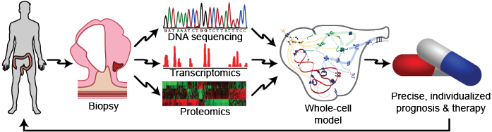
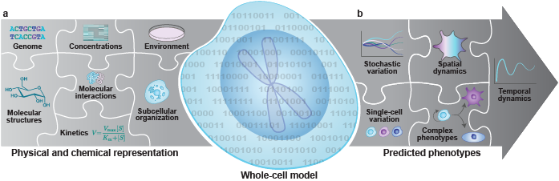
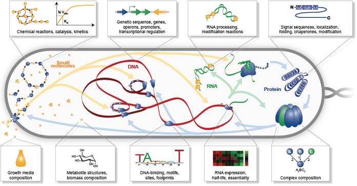
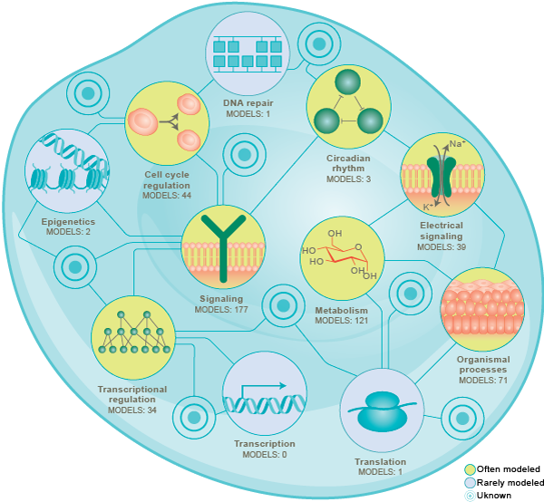
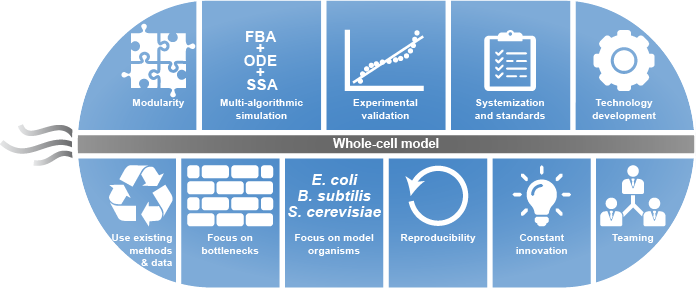
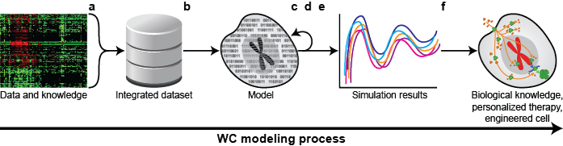
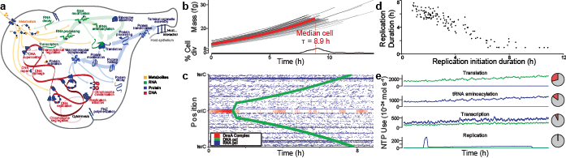
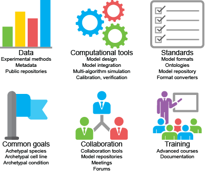
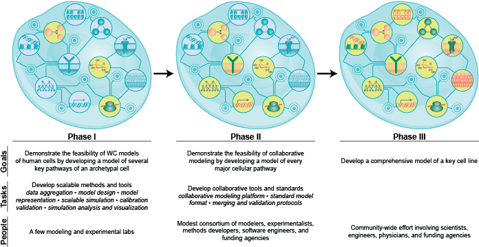

.. _introduction:

#####################
Introduction
#####################

A central goal of biological science is to quantitatively understand how genotype influences phenotype. However, despite decades of research, a growing wealth of experimental data, and extensive knowledge of individual molecules and individual pathways, we still do not understand how biological behavior emerges from the molecular level. For example, we do not understand how transcription factors, non-coding RNA, localization signals, degradation tags, and other regulatory systems interact to control protein expression.

Consequently, physicians still cannot interpret the pathophysiological consequences of genetic variation and bioengineers still cannot rationally design microorganisms. Instead, patients often have to try multiple drugs to find a single effective drug, which exposes patients to unnecessary drugs, prolongs disease, and increases costs. Similarly, bioengineers often have to rely on time-consuming and expensive trial and error methods such as directed evolution :cite:`haseltine2007synthetic,cobb2012directed`.

Many engineering fields use mechanistic models to help understand and design complex systems such as cars :cite:`karnopp2012system`, buildings :cite:`clarke2001energy`, and transportation networks :cite:`cascetta2009transportation`. In particular, mechanistic models can help researchers conduct experiments with complete control, precision, and reproducibility. 

To comprehensively understand cells, we must develop whole-cell (WC) computational models that predict cellular behavior by representing all of the biochemical activity inside cells :cite:`karr2015principles,macklin2014future,tomita2001whole,carrera2015build`. WC models could accelerate biological science by helping researchers unify our knowledge of cell biology, identify gaps in our understanding, and conduct complex experiments that would be infeasible in vitro. WC models could also help bioengineers design microorganisms and help physicians personalize medicine.

Since the 1950's, researchers have been using modeling to understand cells. This has led to numerous models of individual pathways, including models of cell cycle regulation, chemical and electrical signaling, circadian rhythms, metabolism, and transcriptional regulation. Collectively, these efforts have used a wide range of mathematical formalisms including Boolean networks, flux balance analysis (FBA) :cite:`orth2010flux,bordbar2014constraint,feist2008growing`, ordinary differential equations (ODEs), partial differential equations (PDEs), and stochastic simulation :cite:`szigeti2018blueprint`. 

Over the last 20 years, researchers have begun to build more comprehensive models that represent multiple pathways :cite:`tomita1999cell,covert2004integrating,chandrasekaran2010probabilistic,covert2008integrating,lee2008dynamic,carrera2014integrative,thiele2009genome`. Many of these models have built by combining multiple mathematically-dissimilar submodels of individual pathways into a single multi-algorithmic model :cite:`gonccalves2013bridging,takahashi2004multi`.

Although we do not yet have all of the data and methods needed to model entire cells, we believe that WC models are rapidly becoming feasible due to ongoing advances in measurement and computational technology. In particular, we now have a wide array of experimental methods for characterizing cells, numerous repositories which contain much of the data needed for WC modeling, and a variety of tools for extrapolating experimental data to other organisms and conditions. In addition, we now have a wide range of modeling and simulation tools, including tools for designing models, rule-based model formats for describing complex models, and tools for simulating multi-algorithmic models. However, few of these resources support the scale required for WC modeling, and many these resources remain siloed.

Nevertheless, we and others are beginning to model entire cells :cite:`tomita1999cell,atlas2008incorporating,roberts2011noise,karr2012whole,bordbar2015personalized`. In 2012, we and others reported the first dynamical model that represents all of the characterized genes in a cell :cite:`karr2012whole`. The model represents 28 pathways of the small bacterium *Mycoplasma genitalium* and predicts the essentiality of its genes with 80% accuracy.

However, several bottlenecks remain to build more comprehensive and more accurate WC models. In particular, we do not yet have all of the data needed for WC modeling or tools for designing, describing, or simulating WC models. To accelerate WC modeling, we must develop new methods for characterizing the single-cell dynamics of each metabolite and protein; develop new methods for scalably designing, simulating, and calibrating high-dimensional dynamical models; develop new standards for describing and verifying dynamical models; and assemble an interdisciplinary WC modeling community.

In this part, we summarize the scientific, engineering, and medical problems which are motivating WC modeling; propose the phenotypes that WC models should aim to predict and the molecular mechanisms that WC models should aim to represent; outline the fundamental challenges of WC modeling; describe why WC models are feasible by reviewing the existing methods, data, and models which could be leveraged for WC modeling; review the latest WC models and their limitations; outline the most immediate bottlenecks to WC modeling; propose a plan for achieving WC models; and summarize ongoing efforts to advance WC modeling.

Motivation for WC modeling
==========================

In our opinion, WC modeling is motivated by the needs to understand biology, personalize medicine, and design microorganisms. Biological science needs comprehensive models that represent the sequence, function, and interactions of each gene to help scientists holistically understanding cell biology. Similarly, precision medicine needs comprehensive models that predict phenotype from genotype to help physicians interpret the pathophysiological impact of genetic variation which can occur in any gene, and synthetic biology requires comprehensive models to help bioengineers rationally design microbial genomes for a wide range of applications.

In addition, WC models could help researchers address specific scientific problems such as determining how transcriptional regulation, non-coding RNA, and other pathways combine to regulate protein expression. Furthermore, each WC model could be used to address multiple questions, avoiding the need to build separate models for each question. However, few scientific problems require WC models, and we believe that most scientific problems would be more easily addressed with focused modeling.

Here, we describe the main applications which are motivating WC modeling. In the following sections, we define the biology that WC models must represent to support these applications and describe how to achieve such WC models.

Biological science: understand how genotype influences phenotype
-------------------------------------------------------------------------

Historically, the main motivation for WC modeling has been to help scientists understand how genotype and the environment determine phenotype, including how each individual gene, reaction, and pathway contributes to cellular behavior. For example, WC models could help researchers integrate heterogeneous experimental data about multiple genes and pathways. WC models could also help researchers gain novel insights into how pathways interact to control behavior. By comparison to experimental data, WC models could also help researchers identify gaps in our understanding. In addition, WC models would enable researchers to conduct experiments with complete control, infinite scope, and unlimited resolution, which would allow researchers to conduct complex experiments that would be infeasible in vitro.

Medicine: personalize medicine for individual genomes
-------------------------------------------------------------------------

Recent studies have shown that each patient has a unique genome, that genetic variation can occur in any gene and pathway, and that small genetic differences can cause patients to respond differentially to the same drugs. Together, this suggests that medicine could be improved by tailoring therapy to each patient's genome. Physicians are beginning to use data-driven models to tailor medicine to a small number of well-established genetic variants that have large phenotypic effects. Tailoring medicine for all genetic variation requires WC models that represent every gene and that can predict the phenotypic effect of any combination of genetic variation. Such WC models would help physicians predict the most likely prognosis for each patient and identify the best combination of drugs for each patient (:numref:`fig_medical_vision`). For example, WC models could help oncologists conduct personalized in silico drug trials to identify the best chemotherapy regimen for each patient. Similarly, WC models could help obstetricians identify diseases in early fetuses. In addition, WC models could help pharmacologists avoid harmful gene-drug interactions.

.. _fig_medical_vision:

    WC models could transform medicine by helping physicians use patient-specific models informed by genomic data to design personalized prognoses and therapies.

Synthetic biology: rationally design microbial genomes
-------------------------------------------------------------------------

Synthetic biology promises to create microorganisms for a wide range of industrial, medical, security applications such as cheaply producing chemicals, drugs, and fuels; quickly detecting diseased tissue; killing pathogenic bacteria; and decontaminating industrial waste. Currently, microorganisms are often engineered using directed evolution :cite:`haseltine2007synthetic,cobb2012directed`. However, directed evolution is often time-consuming and limited to small phenotypic changes. Recently, researchers at the JCVI have begun to pioneer methods for chemically synthesizing entire genomes :cite:`gibson2010creation`. Realizing the full potential of this methodology requires WC models that can help bioengineers design entire genomes. For example, WC models could help bioengineers analyze the impact of synthetic circuits on host cells, design efficient chassis for synthetic circuits, and design bacterial drug delivery systems that can detect diseased tissue and synthesize drugs in situ.

The biology that WC models should aim to represent and predict
==============================================================

In the previous section, we argued that medicine and bioengineering need comprehensive models that can predict phenotype from genotype. Here, we outline the specific phenotypes that we believe that WC models should aim to predict and the specific physiochemical mechanisms that we believe that WC models should aim to represent to support medicine and bioengineering (:numref:`fig_mechanisms_and_phenotypes`). In the following sections, we outline why we believe that WC models are becoming feasible and describe how to build and simulate WC models.

.. _fig_mechanisms_and_phenotypes:

    The physical and chemical mechanisms that WC models should aim to represent (**a**) and the phenotypes that WC models should aim to predict (**b**).

Phenotypes that WC models should aim to predict
-------------------------------------------------------------------------

To support medicine and bioengineering, we believe that WC models should aim to predict the phenotypes of individual cells over their entire life cycles (:numref:`fig_mechanisms_and_phenotypes`\ b). Specifically, we believe that WC models should aim to predict the following five levels of phenotypes:

    * **Stochastic dynamics:** To help physicians understand how genetic variation affects how cells respond to drugs, and to help bioengineers design microorganisms that are robust to stochastic variation, WC models should predict the stochastic behavior of each molecular species and molecular interaction. For example, this would help physicians design drugs that are robust to variation in RNA splicing, protein modification, and protein complexation. This would also help bioengineers design feedback loops that can control the expression of key RNA and proteins.

    * **Temporal dynamics:** To help physicians understand the impact of genetic variation on cell cycle regulation, and to help bioengineers control the temporal dynamics of microorganisms, WC models should predict the temporal dynamics of the concentration of each molecular species. For example, this would help physicians identify genetic variation that can disrupt cell cycle regulation and cause cancer. This would also help bioengineers design microorganisms that can perform specific tasks at specific times.

    * **Spatial dynamics:** To help physicians predict the intracellular distribution of drugs, and to help bioengineers use space to concentrate and insulate molecular interactions, WC models should predict the concentration of each molecular species in each spatial domain. For example, this would help physicians predict whether drugs interact with their intended targets and predict how quickly cells metabolize drugs. This would also help bioengineers maximize the metabolic activity of microorganisms by co-localizing enzymes and their substrates. 

    * **Single-cell variation:** To help physicians understand how drugs affect populations of heterogeneous cells, and to help bioengineers design robust microorganisms, WC models should predict the single-cell variation of cellular behavior. For example, this would help physicians understand how chemotherapies affect heterogeneous tumors, and help bioengineers design reliable biosensors that activate at the same threshold irrespective of stochastic variation in RNA and protein expression.

    * **Complex phenotypes:** To help physicians understand the impact of variation on complex phenotypes and to help bioengineers design microorganisms that can perform complex phenotypes, WC models should predict complex phenotypes such as the cell shape, growth rate, and fate. For example, this would help physicians identify the primary variants responsible for disease and help physicians screen drugs in silico. This would also help bioengineers design sophisticated strains that can detect tumors, synthesize chemotherapeutics, and deliver drugs directly to tumors.

Physics and chemistry that WC models should aim to represent
-------------------------------------------------------------------------

To predict these phenotypes, we believe that WC models should aim to represent all of the chemical reactions inside cells and all of the physical processes that influence their rates (:numref:`fig_mechanisms_and_phenotypes`\ a). Specifically, we propose that WC models aim to represent the following seven aspects of cells:

    * **Sequences:** To predict how genotype influence phenotype, including the contribution of each individual variant and gene, WC models should represent the sequence of each chromosome, RNA, and protein; the location of each feature of each chromosome such as genes, operons, promoters, and terminators; and the location of each site of each RNA and protein.

    * **Structures:** To predict how molecular species interact and react, WC models should represent the structure of each molecule, including atom-level information about small molecules, the domains and sites of macromolecules, and the subunit composition of complexes. For example, this would enable WC models to predict the metabolism of novel compounds.

    * **Subcellular organization:** To capture the molecular interactions that occur inside cells, WC models should represent the spatial organization of cells and the localization of each of metabolite, RNA, and protein species. For example, this would enable WC models to predict the spatial compartments in which molecular interactions occur.

    * **Concentrations:** To capture the molecular interactions that can occur inside cells, WC models should also represent the concentration of each molecular species in each organelle and spatial domain.

    * **Molecular interactions:** To capture how cells behave over time, WC models should represent the participants and effect of each molecular interaction, including the molecules that are consumed, produced, and transported, the molecular sites that are modified, and the bonds that are broken and formed. For example, this would enable WC models to capture the reactions responsible for cellular growth and homeostatic maintenance.

    * **Kinetic parameters:** To predict the temporal dynamics of cell behavior, WC models should represent the kinetic parameters of each interaction such as the maximum rate of each reaction and the affinity of each enzyme for its substrates and inhibitors. For example, this would enable WC models to predict the impact of genetic variation on the function of each enzyme.

    * **Extracellular environment:** To predict how the extracellular environment, including nutrients, hormones, and drugs, influences cell behavior, WC models should represent the concentration of each species in the extracellular environment. For example, this should enable WC models to predict the minimum media required for growth. 

.. _fundamental_challenges:

Fundamental challenges to WC modeling
=======================================================================

In the previous section, we defined the biology that WC models should represent and predict. Building WC models that represent all of the biochemical activity inside cells and that can predict any cellular phenotype is challenging because this requires integrating molecular behavior to the cellular level across several spatial and temporal scales; assembling a complete molecular understanding of cell biology from incomplete, imprecise, and heterogeneous data; and simulating, calibrating, and validating computationally-expensive, high-dimensional models. Here, we describe these challenges to WC modeling. In the following sections, we describe emerging methods for overcoming these challenges to achieve WC models.

.. _imperfect_data:

Integrating molecular behavior to the cell level over several spatiotemporal scales
-----------------------------------------------------------------------------------

The most fundamental challenge to WC modeling is integrating the behavior of individual species and reactions to the cellular level over several spatial and temporal scales. This is challenging because it requires accurate parameter values and scalable methods for simulating large models. Here, we summarize these challenges.

Sensitivity of phenotypic predictions to molecular parameter values
^^^^^^^^^^^^^^^^^^^^^^^^^^^^^^^^^^^^^^^^^^^^^^^^^^^^^^^^^^^^^^^^^^^^^^^^^

The first challenge to integrating molecular behavior to the cellular level is the sensitivity of model predictions to the values of critical parameters, which necessitates accurate parameter values. Accurately identifying these values is challenging because, as described below, it is challenging to optimize high-dimensional functions and because, as described in :numref:`imperfect_data`, our experimental data is incomplete and imprecise.

High computational cost of simulating large fine-grained models
^^^^^^^^^^^^^^^^^^^^^^^^^^^^^^^^^^^^^^^^^^^^^^^^^^^^^^^^^^^^^^^^^^^^^^^^^

A second challenge to integrating molecular behavior to the cellular level is the high computational cost of simulating entire cells with molecular granularity. For example, simulating one cell cycle of our first WC model of the smallest known freely living organism took a full core-day of an Intel E5520 CPU, or approximately :math:`1 \times 10^{15}` floating-point operations :cite:`karr2012whole`. Based on this data, the fact that human cells are approximately 10\ :sup:`6` larger, and the fact that a typical WC simulation experiment will require at least 1,000 simulation runs, a typical WC simulation experiment of a human cell will require approximately 10\ :sup:`6` core-years. To simulate larger and more complex organisms, we must develop faster parallel simulators.

Assembling a unified molecular understanding of cells from imperfect data
-------------------------------------------------------------------------

In our opinion, the greatest challenge to WC modeling is assembling a unified molecular understanding of cell biology. As illustrated in :numref:`fig_needed_data`, this requires assembling comprehensive data about every molecular species and molecular interaction. For example, to model *M. genitalium* we reconstructed (a) its subcellular organization; (b) its chromosome sequence; (c) the location, length, direction and essentiality of each gene; (d) the organization and promoter of each transcription unit; (e) the expression and degradation rate of each RNA transcript; (f) the specific folding and maturation pathway of each RNA and protein species including the localization, N-terminal cleavage, signal sequence, prosthetic groups, disulfide bonds and chaperone interactions of each protein species; (g) the subunit composition of each macromolecular complex; (h) its genetic code; (i) the binding sites and footprint of every DNA-binding protein; (j) the structure, charge and hydrophobicity of every metabolite; (k) the stoichiometry, catalysis, coenzymes, energetics and kinetics of every chemical reaction; (l) the regulatory role of each transcription factor; (m) its chemical composition and (n) the composition of its growth medium :cite:`karr2013wholecellkb`.

.. _fig_needed_data:

    WC models require comprehensive data about every molecular species and molecular interaction.

This is challenging because our data is incomplete, imprecise, heterogeneous, scattered, and poorly annotated. Here, we summarize these limitations and the challenges they present for WC modeling.

Incomplete data
^^^^^^^^^^^^^^^^^^^^^^^^^^^^^^^^^^^^^^^^^^^^^^^^^^^^^^^^^^^^^^^^^^^^^^^^^

The biggest limitation of our experimental data is that we do not have a complete experimental characterization of a cell. In particular, we have limited genome-scale data about individual metabolites and proteins, limited data about cell cycle dynamics, limited data about cell-to-cell variation, limited data about culture media, and limited data about cellular responses to genetic and environmental perturbations. Many genome-scale datasets are also incomplete. For example, most metabolomics and proteomics methods can only measure small numbers of metabolites and proteins.

Imprecise and noisy data
^^^^^^^^^^^^^^^^^^^^^^^^^^^^^^^^^^^^^^^^^^^^^^^^^^^^^^^^^^^^^^^^^^^^^^^^^

A second limitation of our experimental data is that many of our measurement methods are imprecise and noisy. For example, fluorescent microscopy cannot precisely quantitate single-cell protein abundances, single-cell RNA sequencing cannot reliably discern unexpressed RNA, and mass-spectrometry cannot reliably discern unexpressed proteins.

Heterogeneous experimental methods
^^^^^^^^^^^^^^^^^^^^^^^^^^^^^^^^^^^^^^^^^^^^^^^^^^^^^^^^^^^^^^^^^^^^^^^^^

A third limitation of our experimental data is that our data is highly heterogeneous because we do not have a single experimental technology that is capable of completely characterizing a cell. Rather, we have a wide range of methods for characterizing different aspects of cells at different scales with different levels of resolution. For example, mass-spectrometry can quantitate the concentrations of tens of metabolites, deep sequencing can quantitate the concentrations of tens of thousands RNA, and each biochemical experiment can quantitate one or a few kinetic parameters. 

Consequently, our experimental data also spans a wide range of scales and units. For example, we have extensive molecular information about the participants in each metabolic reaction and their stoichiometries, but we only have limited information about the substrates of each protein chaperone. As a second example, we have extensive single-cell information about RNA expression, but we have limited single-cell data about metabolite concentrations.

Heterogeneous organisms and environmental conditions
^^^^^^^^^^^^^^^^^^^^^^^^^^^^^^^^^^^^^^^^^^^^^^^^^^^^^^^^^^^^^^^^^^^^^^^^^

A fourth limitation of our data is that we only have a small amount of data about each organism and environmental condition, and only a small amount of data from each laboratory. However, collectively, we have a large amount of data.

Siloed data
^^^^^^^^^^^^^^^^^^^^^^^^^^^^^^^^^^^^^^^^^^^^^^^^^^^^^^^^^^^^^^^^^^^^^^^^^

Another limitation of our data is that no resource contains all of the data needed for WC modeling. Rather, our data is scattered across a wide range of databases, websites, textbooks, publications, supplementary materials, and other resources. For example, ArrayExpress :cite:`kolesnikov2015arrayexpress` and the Gene Expression Omnibus :cite:`clough2016gene` (GEO) only contain RNA abundance data, PaxDb only contains protein abundance data :cite:`wang2015version`, and SABIO-RK only contains kinetic data :cite:`wittig2012sabio`. Furthermore, many of these data sources use different identifiers and different units.

Insufficient annotation
^^^^^^^^^^^^^^^^^^^^^^^^^^^^^^^^^^^^^^^^^^^^^^^^^^^^^^^^^^^^^^^^^^^^^^^^^

Furthermore, much of our data is insufficiently annotated to understand its biological semantic meaning and provenance. For example, few RNA-seq datasets in ArrayExpress :cite:`kolesnikov2015arrayexpress` have sufficient metadata to understand the environmental condition that was measured, including the concentration of each metabolite in the growth media and the temperature and pH of the growth media. Similarly, few kinetic measurements in SABIO-RK :cite:`wittig2012sabio` have sufficient metadata to understand the strain that was measured. 

Selecting, calibrating and validating high-dimensional models
-------------------------------------------------------------------------

A third fundamental challenge to WC modeling is the high-dimensionality of WC models which makes WC models susceptible to the "curse of dimensionality", the need for more data to constrain high-dimensional models :cite:`keogh2011curse`. In particular, the curse of dimensionality makes it challenging to select, calibrate, and validate WC models because we do not yet have sufficient data to data to select among multiple possible WC models, avoid overfitting WC models, precisely determine the value of each parameter, or test the accuracy of every possible prediction. Furthermore, it is computationally expensive to select, calibrate, and validate high-dimensional models.

.. _foundational_resources:

Feasibility of WC models
==============================================================

Despite the numerous challenges to WC modeling described in the previous section, we believe that WC modeling is rapidly becoming feasible due to ongoing technological advances throughout computational systems biology, bioinformatics, genomics, molecular cell biology, applied mathematics, computer science, and software engineering including methods for experimentally characterizing cells, repositories for sharing data, tools for building and simulating dynamical models, models of individual pathways, and model repositories. While substantial work remains to adapt and integrate these technologies into a unified framework for WC modeling, these technologies are already forming a strong intellectual foundation for WC modeling. Here, we review the technologies that we believe are making WC modeling feasible, and describe their present limitations for WC modeling. In the following section, we describe how we are beginning to leveraging these technologies to build and simulate WC models.

Experimental methods, data, and repositories
-------------------------------------------------------------------------

Here, we review advances in measurement methods, data repositories, and bioinformatics tools that are generating the data needed for WC modeling, aggregating this data into repositories, and producing tools for extrapolating data to other genotypes and environments.

.. _data:

Measurement methods
^^^^^^^^^^^^^^^^^^^^^^^^^^^^^^^^^^^^^^^^^^^^^^^^^^^^^^^^^^^^^^^^^^^^^^^^^

Advances in biochemical, genomic, and single-cell measurement are rapidly generating the data needed for WC modeling :cite:`macaulay2017single,altelaar2013next,fuhrer2015high` (Table S4). For example, Meth-Seq can assess epigenetic modifications :cite:`laird2010principles`, Hi-C can determine the average structure of chromosomes :cite:`dekker2013exploring`, ChIP-seq can determine protein-DNA interactions :cite:`park2009chip`, fluorescence microscopy can determine protein localizations, mass-spectrometry can quantitate average metabolite concentrations, scRNA-seq :cite:`saliba2014single,kolodziejczyk2015technology` can quantitate the single-cell variation of each RNA :cite:`saliba2014single`, FISH :cite:`lee2014highly` can quantitate the spatiotemporal dynamics and single-cell variation of the abundances of a few RNA, mass spectrometry can quantitate the average abundances of hundreds of proteins :cite:`dettmer2007mass,bantscheff2012quantitative`, mass cytometry can quantitate the single-cell variation of the abundances of tens of proteins :cite:`bendall2012deep`, and fluorescence microscopy can quantitate the spatiotemporal dynamics and single-cell variation of the abundances of a few proteins. However, improved methods are still needed to measure the dynamics of the entire metabolome and proteome.

.. _data_repos:

Data repositories
^^^^^^^^^^^^^^^^^^^^^^^^^^^^^^^^^^^^^^^^^^^^^^^^^^^^^^^^^^^^^^^^^^^^^^^^^

Researchers are rapidly aggregating the experimental data needed for WC modeling into repositories (Table S5). This includes specialized repositories for individual types of data such as ECMDB :cite:`sajed2016ecmdb` and YMDB :cite:`ramirez2017ymdb` for metabolite concentrations; ArrayExpress :cite:`kolesnikov2015arrayexpress` and the Gene Expression Omnibus :cite:`clough2016gene` (GEO) for RNA abundances; PaxDb :cite:`wang2015version` for protein abundances; BiGG :cite:`king2015bigg` for metabolic reactions, and SABIO-RK for kinetic parameters :cite:`wittig2012sabio`, as well as general purpose repositories such as FigShare :cite:`figshare2017`, SimTk :cite:`simtk2017`, and Zenodo :cite:`zenodo2017`.

Some researchers are making the data in these repositories more accessible by standardizing and integrating the data into meta-databases. For example, KEGG contains a variety of information about metabolites, proteins, reactions, and pathways :cite:`kanehisa2017kegg`; Pathway Commons contains extensive information about protein-protein interactions and pathways :cite:`cerami2010pathway`; and UniProt contains a multitude of information about proteins :cite:`uniprot2017uniprot`.

In addition, some researchers are integrating information about individual organisms into PGDBs such as the BioCyc family of databases :cite:`caspi2016metacyc,keseler2017ecocyc`. These databases contain a wide range of information including the stoichiometries of individual reactions, the compositions of individual protein complexes, and the genes regulated by individual transcription factors. Because PGDBs already contain integrated data about a single organism, PGDBs could readily be leveraged to build WC models. In fact, Latendresse developed MetaFlux to build constraint-based models of metabolism from EcoCyc :cite:`latendresse2012construction`.

Furthermore, meta-databases such as *Nucleic Acid Research*'s Database Summary :cite:`galperin201724th` and re3data.org :cite:`pampel2013making` contain lists of data repositories.

Most of these repositories have been developed by encouraging individual researchers to deposit their data or by employing curators to manually extract data from publications, supplementary files, and websites. In addition, researchers are beginning to use natural language processing to develop tools for automatically extracting data from publications :cite:`cohen2015darpa`.

Prediction tools
^^^^^^^^^^^^^^^^^^^^^^^^^^^^^^^^^^^^^^^^^^^^^^^^^^^^^^^^^^^^^^^^^^^^^^^^^

Accurate prediction tools can be a useful alternative to constraining models with direct experimental evidence. Currently, many tools can predict molecular properties such as the organization of genes into operons, RNA folds, and protein localizations (Table S6). For example, PSORTb can predict the localization of bacterial proteins :cite:`yu2010psortb` and TargetScan can predict the mRNA targets of small non-coding RNAs :cite:`agarwal2015predicting`. In particular, these tools can be used to impute missing data and extrapolate observations to other organisms, genetic conditions, and environmental conditions. However, many current prediction tools are not sufficiently accurate for WC modeling.

.. _foundational_resources_modeling:

Modeling and simulation tools
----------------------------------------------------------------------------

Here, we review several advances in modeling and simulation technology that we believe are beginning to enable researchers to aggregate and organize the data needed for WC modeling and design, describe, simulate, calibrate, verify, and analyze WC models.

Data aggregation and organization tools
^^^^^^^^^^^^^^^^^^^^^^^^^^^^^^^^^^^^^^^^^^^^^^^^^^^^^^^^^^^^^^^^^^^^^^^^^

To make the large amount of publicly available data usable for modeling, researchers are developing tools such as BioServices :cite:`cokelaer2013bioservices` for programmatically accessing repositories and using PGDBs to organize the data needed for modeling. PGDBs are well-suited to organizing the data needed for WC models because they support structured representations of metabolites, DNA, RNA, proteins, and their interactions. However, traditional PGDBs provided limited support for non-metabolic pathways and quantitative data. Consequently, we are developing ``WholeCellKB``, a PGDB specifically designed for WC modeling :cite:`karr2013wholecellkb`.

.. _foundational_resources_model_design:

Model design tools
^^^^^^^^^^^^^^^^^^^^^^^^^^^^^^^^^^^^^^^^^^^^^^^^^^^^^^^^^^^^^^^^^^^^^^^^^

Several software tools have been developed for designing models of individual cellular pathways including CellDesigner :cite:`matsuoka2014modeling`, COPASI :cite:`bergmann2017copasi`, and Virtual Cell :cite:`resasco2012virtual` which support dynamical modeling; RuleBender which supports rule-based modeling :cite:`smith2012rulebender`; and COBRApy :cite:`ebrahim2013cobrapy`, FAME :cite:`boele2012fame`, and RAVEN :cite:`agren2013raven` which support constraint-based metabolic modeling; and (Table S7). 

Recently, researchers have developed several tools that support some of the features needed for WC modeling. This includes SEEK which helps researchers design models from data tables :cite:`wolstencroft2015seek`, Virtual Cell which helps researchers design models from KEGG pathways :cite:`resasco2012virtual,kanehisa2017kegg`, MetaFlux which helps researchers design metabolic models from PGDBs :cite:`latendresse2012construction`, the Cell Collective :cite:`helikar2013cell` and JWS Online :cite:`du2013jws` which help researchers build models collaboratively, PySB which helps researchers design models programmatically :cite:`lopez2013programming`, and semanticSBML :cite:`krause2009annotation` and SemGen :cite:`neal2014reappraisal` which help researchers merge models.

However, none of these tools are well-suited to WC modeling because none of these tools support all of the features needed for WC modeling including programmatically designing models from large data sources such as PGDBs; collaboratively designing models over a web-based interface; designing composite, multi-algorithmic models; representing models in terms of rule patterns; and recording the data sources and assumptions used to build models.

.. _methods_model_selection:

Model selection tools
^^^^^^^^^^^^^^^^^^^^^^^^^^^^^^^^^^^^^^^^^^^^^^^^^^^^^^^^^^^^^^^^^^^^^^^^^

Several methods have also been developed to help researchers select among multiple potential models, including likelihood-based, Bayesian, and heuristic methods :cite:`kirk2013model`. ABC-SysBio :cite:`liepe2014framework,toni2009approximate`, ModelMage :cite:`flottmann2008modelmage`, and SYSBIONS :cite:`johnson2014sysbions` are some of the most advanced model selection tools. However, these tools only support deterministic dynamical models.

.. _foundational_resources_model_refinement:

Model refinement tools
^^^^^^^^^^^^^^^^^^^^^^^^^^^^^^^^^^^^^^^^^^^^^^^^^^^^^^^^^^^^^^^^^^^^^^^^^

Several tools have been developed for refining models, including using physiological data to identify molecular gaps in metabolic models and using databases of molecular mechanisms to fill molecular gaps in metabolic models :cite:`orth2010systematizing,blais2013linking`. GapFind uses mixed integer linear programming to identify all of the metabolites that cannot be both produced and consumed in metabolic models, one type of molecular gap in metabolic models :cite:`kumar2007optimization`. GapFill :cite:`kumar2007optimization`, OMNI :cite:`herrgaard2006identification`, and SMILEY :cite:`reed2006systems` use linear programming to identify the most parsimonious set of reactions from reaction databases such as KEGG :cite:`kanehisa2017kegg` to fill molecular gaps in metabolic models. FastGapFill is one of the most efficient of these gap filling tools :cite:`latendresse2014efficiently`. GrowMatch extends gap filling to find the most parsimonious set of reactions that not only fill molecular gaps in metabolic models, but also correct erroneous gene essentiality predictions :cite:`kumar2009growmatch`. ADOMETA :cite:`kharchenko2006identifying`, GAUGE :cite:`hosseini2017discovering`, likelihood-based gap filling :cite:`benedict2014likelihood`, MIRAGE :cite:`vitkin2012mirage`, PathoLogic :cite:`green2004bayesian` and SEED :cite:`osterman2006hidden` extend gap filling further by using sequence homology and other genomic data to identify the genes which most likely catalyze missing reactions in metabolic networks. However, these tools are only applicable to metabolic models.

.. _foundational_resources_model_formats:

Model formats 
^^^^^^^^^^^^^^^^^^^^^^^^^^^^^^^^^^^^^^^^^^^^^^^^^^^^^^^^^^^^^^^^^^^^^^^^^

Several formats have been developed to represent cell models including formats such as CellML :cite:`garny2008cellml` that represent models as collections of variables and equations, formats such as SBML :cite:`hucka2003systems` that represent models as collections of species and reactions, and more abstract formats such as BioNetGen :cite:`harris2016bionetgen`, Kappa :cite:`danos2004formal`, and ML-Rules :cite:`maus2011rule` that represent models as collections of species and rule patterns.

The Systems Biology Markup Language (SBML) was developed in 2002 to represent dynamical models that can be simulated by integrating ordinary differential equations or using the stochastic simulation algorithm, as well as the semantic biological meaning of models. Recently, SBML has been extended to support a wide range of models through the development of several new packages. The flux balance constraints package supports constraint-based models, the qualitative models package supports logical models, the spatial processes package support spatial models that can be simulated by integrating PDEs, the multistate multicomponent species package supports rule-based model descriptions, and the hierarchical model composition package supports composite models. SBML is by far the most widely supported and commonly used format for representing cell models. For example, SBML is supported by COPASI :cite:`bergmann2017copasi`, the most commonly used cell modeling software program and BioModels, the most commonly used cell model repository :cite:`chelliah2015biomodels`. However, SBML creates verbose model descriptions, the multistate multicomponent species package only supports a few types of combinatorial complexity, SBML does not directly support multi-algorithmic models, and SBML cannot represent model provenance including the data sources and assumptions used to build models :cite:`waltemath2016toward`.

More recently, Faeder and others have developed BioNetGen :cite:`harris2016bionetgen` and other rule-based formats to efficiently describe the combinatorial complexity of protein-protein interactions. These formats enable researchers to describe models in terms of species and reaction patterns which can be evaluated to generate all of the individual species and reactions in a model. This abstraction helps researchers describe reactions directly in terms of their chemistry, describe large models concisely, and avoid errors in enumerating species and reactions. Models that are described in rule-based formats such as BioNetGen can be simulated either by enumerating all of the possible species and reactions and then simulating the expanded model via conventional deterministic or stochastic dynamical simulation methods, or via network-free simulation which iteratively discovers individual species and reactions during simulation :cite:`sneddon2011efficient`. BioNetGen is the most commonly used rule-based modeling format and NFsim is the most commonly used network-free simulator. However, BioNetGen only supports few types of combinatorial complexity, BioNetGen does not support composite or multi-algorithmic models, BioNetGen cannot represent the semantic biological meaning of models, and BioNetGen cannot represent model provenance.

Simulation algorithms
^^^^^^^^^^^^^^^^^^^^^^^^^^^^^^^^^^^^^^^^^^^^^^^^^^^^^^^^^^^^^^^^^^^^^^^^^

Several algorithms have been developed to simulate cells with a wide range of granularity including algorithms for integrating systems of ODEs and PDEs, stochastic simulation algorithms, algorithms for simulating logical networks and Petri nets, and hybrid algorithms for co-simulating models that are composed of mathematically-dissimilar submodels.

The most commonly used algorithms to simulate cell models include algorithms for integrating systems of ODEs. These algorithms are best suited to simulating well-characterized and well-mixed systems that involve large concentrations that are robust to stochastic fluctuations. These algorithms are poorly suited to simulating stochastic processes that involve small concentrations, as well as poorly characterized pathways with little kinetic data. Consequently, ODE integration algorithms are poorly suited for WC modeling.

Stochastic simulation algorithms such as the Stochastic Simulation Algorithm (SSA) or Gillespie's Algorithm :cite:`gillespie1977exact`, newer, more efficient implementations of SSA such as the Gibson-Bruck method and RSSA-CR :cite:`thanh2017efficient`, and approximations of SSA such as tau leaping, are commonly used to simulate pathways that involve small concentrations that are susceptible stochastic variation. However, these algorithms are only suitable for dynamical models which require substantial kinetic data, they are computationally expensive, especially for models that include reactions that have high fluxes, and they are limited to models with small state spaces. Consequently, stochastic simulation algorithms are poorly suited for simulating WC models.

Network-free simulation algorithms are stochastic simulation algorithms for efficiently simulating rule-based models without enumerating every possible species and reaction prior to simulation and instead discovering the active species and reactions during simulation. Unlike traditional stochastic simulation algorithms, network-free simulation algorithms can represent large models that have combinatorially large or even infinite state spaces. Otherwise, network-free stochastic simulation algorithms have the same limitations as other stochastic simulation algorithms.

FBA is the second-most commonly used algorithm for simulating cell models. FBA predicts the steady-state flux of each metabolic reaction using detailed information about the stoichiometry and catalysis of each reaction, a small amount of quantitative data about the chemical composition of cells, a small amount of data about the exchange rate of each extracellular nutrient, and the assumption that metabolism has evolved to maximize the rate of cellular growth. However, FBA has limited ability to predict metabolite concentrations and temporal dynamics, and its assumptions are largely only applicable to microbial metabolism. Consequently, FBA is not well-suited to simulating entire cells.

Logical simulation algorithms are frequently used for coarse-grained simulations of transcriptional regulation and other pathways for which we have limited kinetic data. Logical simulations are computationally efficient because they are coarse-grained. However, logical simulation algorithms are poorly suited to WC modeling because they cannot generate detailed quantitative predictions, and therefore have limited utility for medicine and bioengineering.

Multi-algorithmic simulations are ideal for WC modeling because they can simulate models that include fine-grained representations of well-characterized pathways, as well as coarse-grained representations of poorly-characterized pathways. Takahashi et al. developed one of the first algorithms for co-simulating multiple mathematically-dissimilar submodels :cite:`takahashi2004multi`. However, their algorithm is not well-suited to WC modeling because it does not support FBA or network-free simulation. Recently, we and others developed a multi-algorithm simulation meta-algorithm which supports ODE integration, conventional stochastic simulation, network-free stochastic simulation, FBA, and logical simulation :cite:`karr2012whole`. However, our algorithm violates the arrow of time and is not scalable to large models. 

Simulation experiment formats
^^^^^^^^^^^^^^^^^^^^^^^^^^^^^^^^^^^^^^^^^^^^^^^^^^^^^^^^^^^^^^^^^^^^^^^^^

The Minimum Information About a Simulation Experiment (MIASE) guidelines have been developed to establish the minimum metadata that should be provided about a simulation experiment to enable other researchers to reproduce and understand the simulation :cite:`waltemath2011minimum`. The Simulation Experiment Description Markup Language (SED-ML) :cite:`waltemath2011reproducible` and the Simulation Experiment Specification via a Scala Layer (SESSL) :cite:`ewald2014sessl` formats have been developed to represent simulation experiments. Both formats are capable of representing all of the model parameters and simulator arguments needed to simulate a model. However, both formats are limited to a small range of model formats and simulators. SED-ML is limited to models that are represented using XML-based formats such as SBML, and SESSL is currently limited to Java-based simulators. Consequently, neither is currently well-suited to WC modeling. 

Simulation tools
^^^^^^^^^^^^^^^^^^^^^^^^^^^^^^^^^^^^^^^^^^^^^^^^^^^^^^^^^^^^^^^^^^^^^^^^^

Numerous tools have been developed to simulate cell models including the Cell Collective :cite:`helikar2013cell`, COBRApy :cite:`ebrahim2013cobrapy`, COPASI :cite:`bergmann2017copasi`, E-Cell :cite:`dhar2006cell`, FAME :cite:`boele2012fame`, libRoadRunner :cite:`somogyi2015libroadrunner`, JWS Online :cite:`du2013jws`, NFsim :cite:`sneddon2011efficient`, RAVEN :cite:`agren2013raven`, and Virtual Cell :cite:`resasco2012virtual`.

COPASI is the most commonly used simulation tool. COPASI supports several deterministic, stochastic, and hybrid deterministic/stochastic simulation algorithms. However, COPASI does not support network-free stochastic simulation, FBA, logical, or multi-algorithmic simulation and COPASI does not support high-performance parallel simulation of large models.

Virtual Cell supports several deterministic, stochastic, hybrid deterministic/stochastic, network-free, and spatial simulation algorithms. However, Virtual Cell does not support FBA or multi-algorithmic simulations and Virtual Cell does not support high-performance parallel simulation of large models.

COBRApy, FAME, and RAVEN support FBA of metabolic models. However, these packages provide no support for other types of models.

E-Cell is one of the only simulation programs that supports multi-algorithmic simulation. However, E-Cell does not support FBA or rule-based simulation, and E-Cell does not scale well to large models.

Several tools including cupSODA :cite:`nobile2013cupsoda`, cuTauLeaping :cite:`nobile2014cutauleaping`, and Rensselaer’s Optimistic Simulation System (ROSS) :cite:`carothers2002ross` have been developed to simulate models in parallel. However, cupSODA only supports deterministic simulation, cuTauLeaping only supports network-based stochastic simulation, cupSODA and cuTauLeaping only support GPUs, and ROSS is a low-level, general-purpose framework for distributed CPU simulation.

.. _foundational_resources_calibration:

Calibration tools
^^^^^^^^^^^^^^^^^^^^^^^^^^^^^^^^^^^^^^^^^^^^^^^^^^^^^^^^^^^^^^^^^^^^^^^^^

Several methods tools have been developed to calibrate cell models :cite:`chis2011structural,ashyraliyev2009systems,chou2009recent,sun2012parameter,moles2003parameter`. In addition, aerospace and mechanical engineers have developed methods for using reduced models to efficiently calibrate large models :cite:`forrester2009recent`. DAISY is one of the most advanced tools for evaluating the identifiability of a model :cite:`bellu2007daisy`. Several of the most popular simulation programs, including COPASI :cite:`bergmann2017copasi` and Virtual Cell :cite:`resasco2012virtual`, provide tools for calibrating models. Some of the most advanced model calibration tools include ABC-SysBio which uses approximate Bayesian computation :cite:`liepe2014framework`, saCeSS which supports distributed, collaborative calibration :cite:`penas2017parameter`, and SBSI which supports several distributed calibration methods :cite:`adams2013sbsi`. However, none of these tools support multi-algorithmic models.

.. _foundational_resources_verification:

Verification tools
^^^^^^^^^^^^^^^^^^^^^^^^^^^^^^^^^^^^^^^^^^^^^^^^^^^^^^^^^^^^^^^^^^^^^^^^^

Several tools have been developed to verify cell models, including formal verification tools that seek to prove or refute mathematical properties of models and informal verification tools that help modelers organize and evaluate computational tests of models. BioLab :cite:`clarke2008statistical` and PRISM :cite:`kwiatkowska2011prism` are formal tools for verifying BioNetGen-encoded and SBML-encoded models, respectively. Memote :cite:`lieven2017memote` and SciUnit :cite:`omar2014collaborative` are unit testing frameworks for organizing computational tests of models. Continuous integration tools such as CircleCI :cite:`circleci2017` and Jenkins :cite:`jenkins2017` can be used to regularly verify models each time they are modified and pushed to a version control system (VCS) such as Git :cite:`git2017`.

Simulation results formats
^^^^^^^^^^^^^^^^^^^^^^^^^^^^^^^^^^^^^^^^^^^^^^^^^^^^^^^^^^^^^^^^^^^^^^^^^

HDF5 is an ideal format for storing simulation results :cite:`folk2011overview`. In particular, HDF5 supports hierarchical data structures, HDF5 supports compression, HDF5 supports chunking to facilitate fast retrieval of small slices of large datasets, HDF5 can store both simulation results and their metadata, and there are HDF5 libraries available for several languages including C++, Java, MATLAB, Python, and R.

Simulation results databases
^^^^^^^^^^^^^^^^^^^^^^^^^^^^^^^^^^^^^^^^^^^^^^^^^^^^^^^^^^^^^^^^^^^^^^^^^

Several database systems have been developed to organize simulation results for visual and mathematical analysis and disseminate simulation results to the community :cite:`vohra2010bookshelf,finocchiaro2003dsmm,van2010dynameomics,meyer2010model,lemson2006halo,riebe2013multidark,wolstencroft2011seek`. We developed ``WholeCellSimDB``, a hybrid relational/HDF5 database, to organize, search, and share WC simulation results :cite:`karr2014wholecellsimdb`. WholeCellSimDB uses HDF5 to store simulation results and a relational database to store their metadata. This enables WholeCellSimDB to efficiently store simulation results, quickly search simulations by their metadata, and quickly retrieve slices of simulation results. WholeCellSimDB providers uses two interfaces to deposit simulation results; a web-based interface to search, browse, and visualize simulation results; and a JSON web service to retrieve simulation results. However, further work is needed to scale WholeCellSimDB to larger models and to develop tools for quickly searching WholeCellSimDB.

Simulation results analysis
^^^^^^^^^^^^^^^^^^^^^^^^^^^^^^^^^^^^^^^^^^^^^^^^^^^^^^^^^^^^^^^^^^^^^^^^^

Several tools have been developed to analyze and visualize simulation results. The most popular simulation software programs, including COPASI :cite:`bergmann2017copasi` and Virtual Cell :cite:`resasco2012virtual`, provide basic tools for visualizing simulation results. Tools such as Escher :cite:`king2015escher` and Pathway Tools Omics Viewer :cite:`paley2006pathway` can also be used to visualize simulation results. 

We developed ``WholeCellViz`` to visualize WC simulation results in their biological context :cite:`lee2013wholecellviz`. WholeCellViz provides users time series plots and interactive animations to visualize model predictions, and enables users to arrange grids of plots and animations to help users compare predictions across multiple simulation runs and simulated conditions. However, further work is needed to scale WholeCellViz to larger models and to make it easier to incorporate new visualizations into WholeCellViz.

.. _existing_models:

Models of individual pathways and model repositories
-------------------------------------------------------------------------

Since the 1950's, researchers have been using the tools described above to model cells. This has led to numerous models that represent individual pathways. Here, we review our progress in modeling individual pathways, building repositories of cell models, and their utility for WC modeling.

Models of individual pathways
^^^^^^^^^^^^^^^^^^^^^^^^^^^^^^^^^^^^^^^^^^^^^^^^^^^^^^^^^^^^^^^^^^^^^^^^^

Over the past 30 years, researchers have developed a wide range of models of individual cellular pathways :cite:`chelliah2015biomodels` (:numref:`fig_existing_models`, Table S1). In particular, researchers have developed models of cell cycle regulation :cite:`sible2007mathematical`; circadian rhythms :cite:`goldbeter2002computational`; electrical signaling :cite:`herz2006modeling`; metabolism :cite:`swainston2016recon,agren2012reconstruction,uhlen2017pathology`; signaling pathways such as the JAK/STAT, NF-:math:`\kappa`\ B, p53, and TGF\ :math:`\beta` pathways :cite:`hughey2010computational`; transcriptional regulation :cite:`gerstein2012architecture`, and multicellular processes such as developmental patterning :cite:`kondo2010reaction` and infection. However, many pathways have not been modeled at the scale of entire cells, including several well-studied pathways. For example, although we have extensive knowledge of the mutations responsible for cancer, we have few models of DNA repair; although we have extensive structural and catalytic information about RNA modification, we have few kinetic models of RNA modification; and although we have detailed atomistic models of protein folding, we have few cell-scale models of chaperone-mediated folding.

.. _fig_existing_models:

    WC models can be built by leveraging existing models of well-studied processes (colors) and developing new models of other processes (gray).

Collectively, these models span a broad range of scales. For example, although most of these models represent the chemical transformations responsible for each pathway, some of these models, such as most transcriptional regulation models, use coarser representations. As a second example, although most of these models represent temporal dynamics, most metabolic models only represent the steady-state behavior of metabolism :cite:`orth2010flux`. Similarly, although most of these models represent cells as well-mixed bags, some of these models represent the spatial distribution of individual compounds including nutrients and hormones :cite:`geitmann2009mechanics,huang2003dynamic,erickson2009modeling`. In addition, although most of these models represent the mean behavior of cells, averaged over multiple cells and cell cycle phases, a few of these models represent the temporal dynamics of the cell cycle and the variation among single cells.

Collectively, these models also use a wide range of computational representations and simulation algorithms. Many of these models are represented as reaction networks. However, some of the largest of these models must be represented using rules :cite:`harris2016bionetgen` or Boolean networks. Many of these models can be simulated by integrating ODEs. However, some of the largest models must be simulated using network-free methods :cite:`sneddon2011efficient`, the steady-state metabolism models must be simulated with FBA :cite:`orth2010flux`, some of the spatiotemporal models must be simulated by integrating PDEs, and some of the network models must be simulated by iteratively evaluating Boolean regulatory functions :cite:`karlebach2008modelling`.

These pathway models could be used to help build WC models. However, substantial work would be required to integrate these models into a single model because these models describe different scales, make different assumptions, are represented using different mathematical formalisms, are calibrated to different organisms and conditions, and are represented using different identifiers and formats. To avoid needing to substantially revise pathway models for incorporation into WC models, modelers should build pathway models explicitly for integration into WC models. This requires the modeling community to embrace a common format, common identifiers, common units, and common standards for model calibration and validation.

Model repositories
^^^^^^^^^^^^^^^^^^^^^^^^^^^^^^^^^^^^^^^^^^^^^^^^^^^^^^^^^^^^^^^^^^^^^^^^^

Several model repositories, including BioModels :cite:`chelliah2015biomodels` and the Physiome Model Repository :cite:`yu2011physiome`, have been developed to make it easy to find models (Table S3). However, only a few of these repositories support integrated models; most of these repositories only support a limited number of model formats; many reported models are never deposited to any model repository; many of the models that are deposited are not sufficiently annotated for other researchers to understand, reuse, and extend the models; and only a few of the repositories also support the information needed to simulate models such as parameter values.

.. _wc_methods:

Emerging principles and methods for WC modeling
======================================================================

In the previous section, we outlined the ongoing technological advances that are making WC modeling feasible. Here, we propose several principles for WC modeling and describe how we and others are adapting and integrating these technologies into a methodology for WC modeling. In the following sections, we outline the major remaining bottlenecks to WC modeling, highlight ongoing efforts to overcome these bottlenecks, and describe how we are beginning to use this methodology to build WC models.

Principles of WC modeling
-------------------------------------------------------------------------

Based on our experience, we propose several guiding principles for WC modeling (:numref:`fig_principles`).

    * **Modular modeling.** Similar to other large engineered systems such as software, WC models should be built by partitioning cells into pathways, outlining the interfaces among these pathways, building submodels of each pathway, and combining these submodels into a single model. This approach reduces the dimensionality of model construction, calibration, and validation and facilitates collaborative modeling.

    * **Multi-algorithmic simulation.** Furthermore, to capture both well- and poorly-characterized pathways, each submodel should be represented using the most appropriate mathematical representation given our knowledge of each pathway.

    * **Experimental validation.** WC models should be extensively validated via comparison to detailed experimental data across a wide range of molecular mechanisms, phenotypes, and scales.

    * **Systemization and standards.** To scale modeling to entire cells and facilitate collaboration, we should systemize every aspect of dynamical modeling, develop standards for describing WC models and standard protocols for validating and merging model components, and encourage researchers to embrace these standard protocols and formats.

    * **Technology development.** To enable WC modeling, we must develop technologies for systematically and scalably building, calibrating, simulating, and validating WC models. These technologies should be modular to facilitate collaborative technology development and integrated into a unified framework to provide modelers user-friendly modeling and simulation tools.    

    * **Leverage existing methods and data.** Where possible, WC modeling should take advantage of existing computational methods and experimental data. For example, WC modeling should take advantage of parallel simulation methods developed by computer science and WC models should be built, in large part, from data aggregated from public repositories.

    * **Focus on critical problems and clear, achievable goals.** To maximize our efforts, we should periodically identify the key bottlenecks to WC modeling and periodically refocus our efforts on overcoming these bottlenecks. Based on lessons learned from other "big science" projects :cite:`hilgartner2013constituting,collins2003human`, we should also delineate clear goals and clearly define the responsibilities of each researcher.

    * **Focus on model organisms.** To facilitate collaboration, early WC modeling efforts should focus on a small number of organisms and cell lines that are easy to culture, well-characterized, karyotypically and phenotypically "normal", genomically stable and relevant to a wide range of basic science, medicine, and bioengineering. This includes well-characterized bacteria such as *Escherichia coli* and well-characterized human cell lines such as the H1 human embryonic stem cell (hESC) line.

    * **Reproducibility, transparency, extensibility, and openness.** To facilitate collaboration and maximize impact, WC models and simulations should be reproducible, comprehensible, and extensible. For example, to enable other modelers to understand a model, the biological semantic meaning of each species and reaction should be annotated, the data sources and assumptions used to design the model should be annotated, and the parameter values used to produce each simulation result should be recorded. Furthermore, each WC model and WC modeling technology should be free and open-source.

    * **Constant innovation.** Because we do not yet know exactly what WC models should represent, what WC models should predict, or how to build WC models, we should periodically evaluate the quality of our models and methods and iteratively improve our models and methods as we learn more about cell biology and WC modeling. This should include how we partition cells into pathways, the interfaces that we define among the pathways, and how we simulate multi-algorithmic models.

    * **Interdisciplinary collaboration.** WC modeling should be an interdisciplinary collaboration among modelers, experimentalists, computer scientists, and engineers, and research sponsors. Furthermore, there should be open and frequent communication among the WC modeling community.
    
.. _fig_principles:

    Principles of WC modeling.

Methods for WC modeling
-------------------------------------------------------------------------

To enable WC models, we and others are adapting and integrating the technologies described in :numref:` Section %s <foundational_resources_modeling>` into a workflow for scalably building, simulating, and validating WC models (:numref:`fig_workflow`). (1) Modelers will use ``Datanator`` to aggregate, standardize, and integrate the experimental data that they will need to build, calibrate, and validate their model into a single dataset. (2) Modelers will use this data to design submodels of each individual pathway using the most appropriate mathematical representation for each pathway, and encode their model in ``wc_rules``, a rule-based format for describing WC models. (3) Modelers will construct reduced models, and use them to calibrate each submodel and their entire model. (4) Modelers will use formal verification and/or unit testing to verify that their model functions as intended and recapitulates the data used to build the model. (5) Modelers will use ``wc_sim``, a scalable, network-free, multi-algorithmic simulator, to simulate their model. (6) Modelers will use ``WholeCellSimDB`` to organize their simulation results and use ``WholeCellViz`` to visually analyze these results. Importantly, every tool in this workflow will facilitate collaboration to help researchers work together, and these tools will be modular to enable us and others to continuously improve this methodology. We plan to implement this workflow by leveraging recent advances in computational and experimental technology (:numref:`foundational_resources`). Here, we describe the six steps of this emerging workflow.

.. _fig_workflow:

    Emerging workflow for scalably building, simulating, and validating WC models. (**a**) Modelers will aggregate the data for WC modeling into a single dataset. (**b**) Modelers will use this data to design multi-algorithmic WC models. (**c,d**) Modelers will use reduced models to calibrate, verify, and validate models. (**e**) Modelers will simulate multi-algorithmic WC models by co-simulating their submodels. (**f**) Modelers will visualize and analyze their results to discover new biology, personalize medicine, and design microorganisms.

Data aggregation, standardization, and integration
^^^^^^^^^^^^^^^^^^^^^^^^^^^^^^^^^^^^^^^^^^^^^^^^^^^^^^^^^^^^^^^^^^^^^^^^^

The first step of WC modeling is to aggregate, standardize, integrate, and select the experimental data needed for WC modeling into a single dataset for model building, calibration, and validation (:numref:`fig_workflow`\ a).

First, we must aggregate a wide range of experimental data from a wide range of databases such as such as biochemical data about metabolite concentrations from ECMDB :cite:`sajed2016ecmdb`, RNA-seq data about RNA concentrations from ArrayExpress :cite:`kolesnikov2015arrayexpress`, and mass-spectrometry data about metabolite concentrations from PaxDb :cite:`wang2015version`. Where possible, data should be aggregated using database downloads and web services. Otherwise, data should be aggregated by scraping webpages. In addition to aggregating data from databases, we should also aggregate data from collaborators, individual publications, and bioinformatics prediction tools such as PSORTb :cite:`yu2010psortb` and TargetScan :cite:`agarwal2015predicting`.

To the extent possible, we should record the provenance of this data including the biosample (e.g., species, strain, genetic variants) and environmental conditions (e.g., temperature, pH, growth media) that were measured, the experimental method used to generate the data, the computational method used to analyze the data, and the citation for original data to help us select the most relevant data for modeling and trace models back to their data sources.

Second, we must standardize the identifiers and units used to describe this data. For example, metabolites should be identified using the IUPAC International Chemical Identifier (InChI) format :cite:`heller2013inchi` and RNA should be identified by their genomic coordinates. Similarly, all units should be standardized to SI units or combinations of SI units.

Third, we must integrate this data by linking the data together through common metabolites, chromosomes, RNA, proteins, and interactions. To enable this data to be quickly searched and explored, this data should be organized into a relational database. 

Fourth, we must identify the most relevant data within our database for the species and environmental condition that we want to model. For each experimental measurement that we need to constrain a model, we must search our database for data observed for similar biology (e.g., metabolites, RNA, proteins, and interactions), genotypes (e.g., species, strain, and genetic variants), and environmental conditions (e.g., temperature, pH, growth media); calculate the relevance of each experimental observation; and calculate the consensus of the relevant observations, weighted by their relevance. 

Fifth, we should organize these consensus experimental values and their provenance (experimental evidence and the method used to calculate the consensus value) into a single dataset. Pathway/genome databases (PGDB) can be used to organize this information because PGDBs are well-suited to representing relationships among experimental data about a single species. We have developed the ``WholeCellKB`` PGDB to organize the data needed for WC modeling. WholeCellKB provides users three interfaces to deposit experimental data for WC models, extensive functionality for validating this data, a web-based user interface to search and browse this data, and a JSON web service to programmatically retrieve data for model construction.

.. _wc_methods_model_design:

Model design
^^^^^^^^^^^^^^^^^^^^^^^^^^^^^^^^^^^^^^^^^^^^^^^^^^^^^^^^^^^^^^^^^^^^^^^^^

The second step of WC modeling is to use the data aggregated in the first step to design models, including each species and interaction (:numref:`fig_workflow`\ b). To represent the details of well-characterized pathways, as well as coarsely represent poorly-characterized pathways, WC models should be built by partitioning cells into pathways, modeling each pathway using the most appropriate mathematical representation, and combining pathway submodels into composite, multi-algorithmic models. 

To capture the large number of possible cellular phenotypes, WC models should also capture the combinatorial complexity of cellular biochemistry. For example, WC models should represent the combinatorial number of RNA transcripts that can be produced from the interactions of transcription, RNA editing, RNA folding, and RNA degradation; WC models should represent the combinatorial number of possible interactions among the subunits of protein complexes; and the combinatorial number of phosphorylation states of each protein complex. 

To generate accurate predictions, WC models should also aim to represent the aggregate physiology of poorly understood biology such as uncharacterized genes, uncharacterized small peptides, and uncharacterized non-coding RNA. This can be accomplished by including lumped reactions that represent the aggregate physiology of all unknown biology. For example,  to accurately predict metabolic reaction fluxes, like FBA models, WC models can include reactions that capture the aggregate energy usage of all uncharacterized interactions.

To scalably and reproducibly build WC models, WC models should be programmatically built from PGDBs using scripting tools such as PySB :cite:`lopez2013programming`.

Because WC models will never be complete, WC models should be built by designing an initial model and then iteratively improving the model until the model accurately predicts new experimental measurements. In particular, WC models can be systematically refined by identifying gaps between their bottom-up descriptions of cellular biochemistry and our physiological knowledge, searching for reactions and gene products that might fill those gaps, and parsimoniously adding species and reactions to models so they recapitulate experimental observations. Model selection methods can also be used to select among multiple potential model designs. Furthermore, version control systems such as Git :cite:`git2017` should be used to track model changes and enable collaborators to refine models in parallel and merge their refined models.

To enable other researchers to reproduce, understand, reuse, and extend WC models, WC models should be encoded in rule-based formats such as BioNetGen and extensively annotated. In particular, rule-based formats enable researchers to concisely describe the combinatorial complexity of cell biology. Model annotations should include semantic annotations about the biological meaning of each species and interaction such as the chemical structure of each metabolite in InChI format :cite:`heller2013inchi` and provenance annotations about the data sources, assumptions, and design decisions behind each species, interaction, and pathway.

Model calibration
^^^^^^^^^^^^^^^^^^^^^^^^^^^^^^^^^^^^^^^^^^^^^^^^^^^^^^^^^^^^^^^^^^^^^^^^^

The third step in WC modeling is to calibrate model parameters (:numref:`fig_workflow`\ c). This should be done by using numerical optimization methods to minimize the distance between the model's predictions and related experimental observations. One promising method for calibrating composite WC models is to (a) use multi-algorithmic modeling to only create parameters whose values can be constrained by one or a small number of experimental measurements, (b) estimate the value of each individual parameter using one or a small number of experimental observations, (c) construct a set of reduced models, one for each submodel, to estimate the joint values of the parameters, and (d) use distributed global optimization tools such as saCeSS :cite:`penas2017parameter` to refine the joint values of the parameters :cite:`karr2015summary`. This method avoids the need to calibrate large numbers of parameters of physiological data; performs the majority of model calibration using low dimensional models of individual species, reactions, and pathways; and generates successively better starting points for more refined calibration.

Model verification and validation
^^^^^^^^^^^^^^^^^^^^^^^^^^^^^^^^^^^^^^^^^^^^^^^^^^^^^^^^^^^^^^^^^^^^^^^^^

The fourth step in WC modeling is to verify that models behave as intended and validate that models recapitulate the true biology (:numref:`fig_workflow`\ d). First, WC should be verified models using a series of increasingly comprehensive unit tests that test each individual species, reaction, and pathway, as well as groups of pathways and entire models. Importantly, these tests should cover all of the logic of the model. For example, these tests should test the edge cases of every rate law. Reduced models should be used to efficiently test individual species, reactions, and pathway submodels. Furthermore, to quickly identify errors, continuous integration systems such as Jenkins :cite:`jenkins2017` should be used to automatically execute tests each time models are revised. Alternatively, models can be verified using formal verification systems such as PRISM :cite:`kwiatkowska2011prism`. However, substantial work remains to adapt formal verification to multi-algorithmic dynamical modeling.

Second, WC models should be validated by comparing their simulation results to independent experimental data that was not used for model construction or calibration. To be effective, models should be tested using a broad range of data that spans different types of predictions, genetic perturbations, and environmental conditions.

Third, because it is infeasible to validate possible model prediction, modelers should annotate how models were validated to help other modelers know which model predictions can be trusted, know which predictions still need to be validated, and reuse the validation data to validate improved and/or extended models. These annotations should include which data were used for validation, which predictions were validated, and how well the model recapitulated each experimental observation. We believe that this metadata will be critical for medicine where therapy should only be driven by validated model predictions.

Network-free multi-algorithmic simulation
^^^^^^^^^^^^^^^^^^^^^^^^^^^^^^^^^^^^^^^^^^^^^^^^^^^^^^^^^^^^^^^^^^^^^^^^^

The fifth step of WC modeling is to numerically simulate WC models (:numref:`fig_workflow`\ e). Because WC models should be described using rules and composed of multiple mathematically-dissimilar submodels, WC models simulated by co-simulating their submodels. This can be achieved in three steps. First, all of the submodels should be converted to explicit time-driven submodels. For example, Boolean submodels should be converted to SSA submodels by assuming typical concentrations and kinetic rates. Second, all of the mathematically-similar submodels should be analytically merged into a single mathematically-equivalent submodel. Third, for WC models that are composed only of FBA, ODE, and ODE submodels, (a) the SSA submodel should be used as the master clock for the integration and synchronization of the submodels, (b) each time the SSA submodel advances to the next iteration, the FBA and ODE submodels should be synchronized with the SSA submodel and integrated for the same timestep as the SSA submodel, (c) and the SSA submodel should be synchronized with the FBA and ODE models. If the FBA or ODE models generate unphysical states such as negative concentrations, they must be rolled back and reintegrated for multiple smaller timesteps. To efficiently simulate WC models, the FBA and ODE models should only be evaluated periodically. 

To efficiently simulate the combinatorial complexity represented by WC models, most submodels should be simulated using SSA and SSA should be implemented using network-free graph-based methods. Specifically, SSA should be implemented by representing each molecule as a graph, representing each reaction rule as a graph, searching for matching pairs of species-reaction graphs to determine the rate of each reaction, randomly selecting a reaction to fire, updating the species involved in the selected reaction, and using a species-reaction dependency graph to update the rates of all affected reactions. This methodology will enable WC simulations to scale to large numbers of possible species and reactions by only representing the configuration of each active molecule rather than representing the copy number of each possible species. 

To simulate WC models quickly, WC models should be simulated using a distributed simulation framework such as parallel discrete event simulation (PDES) and partitioning WC models into cliques of tightly connected species and reactions. 

To make WC simulations comprehensible and reproducible, WC simulations should be represented using a common format such as SED-ML or SESSL.

Visualization and analysis of simulation results
^^^^^^^^^^^^^^^^^^^^^^^^^^^^^^^^^^^^^^^^^^^^^^^^^^^^^^^^^^^^^^^^^^^^^^^^^

The sixth step of WC modeling is to visualize and analyze WC simulation results to discover new biology, personalize medicine, or design microbial genomes (:numref:`fig_workflow`\ f). First, all of the metadata needed to understand and reproduce simulation results should be recorded, including the model, the version of the model, the parameter values, and the random number generator seed that was simulated. Second, simulation results should be logged and stored in HDF5 format :cite:`folk2011overview`. Third, WC simulation results and their metadata should be organized using a tool such as ``WholeCellSimDB`` that helps researchers search, slice, reduce, and share simulation results. Fourth, researchers should use tools such as ``WholeCellViz`` to visually analyze WC simulation results and use visualization grammars such as Vega :cite:`satyanarayan2017vega` to develop custom diagrams.

Latest WC models and their limitations
==============================================================

Models of multiple pathways
-------------------------------------------------------------------------

Since 1999 when Tomita *et al.* reported one of the first models of multiple pathways of *M. genitalium* :cite:`tomita1999cell`, researchers have been trying to build increasingly comprehensive models of multiple pathways. In particular, this has led to models of *Escherichia coli* and *Saccharomyces cerevisiae* which describe their metabolism and transcriptional regulation :cite:`covert2004integrating,chandrasekaran2010probabilistic`; their metabolism, signaling, and transcriptional regulation :cite:`covert2008integrating,lee2008dynamic,carrera2014integrative`; and their metabolism and RNA and protein synthesis and degradation :cite:`thiele2009genome`. Table S2 summarizes several recently published and proposed models of multiple pathways. Despite this progress, these models only represent a small number of pathways and a small number of organisms.

To represent multiple pathways, most of these models have been developed by combining separate submodels of each pathway, using the most appropriate mathematical representation for each pathway. This has led to multi-algorithmic models which must be simulated by co-simulating the individual submodels. Because there are few multi-algorithmic simulation tools and most of these models only combine two or three submodels, the developers of most of these models have developed ad hoc methods to simulate their models. For example, Covert et al. developed an ad hoc method to simulate their hybrid dynamic FBA / Boolean model of the metabolism and transcriptional regulation of *E. coli* :cite:`covert2004integrating` and Chandrasekaran and Price developed a different ad hoc method to simulate their hybrid FBA / Bayesian model of the metabolism and transcriptional regulation of *E. coli* :cite:`chandrasekaran2010probabilistic`. Because there are few tools for working with such integrative models, these models have also been described with different ad hoc formats and identifiers, simulated with different ad hoc simulation software programs, and calibrated and validated with different ad hoc methods.

WC models
-------------------------------------------------------------------------

Toward WC models, recently, we and others demonstrated the first model which represents every characterized gene function of a cell :cite:`karr2012whole` (:numref:`fig_mgen_model`\ a). The model represents 28 pathways of *M. genitalium*, and was developed by building and combining 28 separate submodels of each pathway using data from over 900 databases and publications. To help us organize the data used to build the model, we developed WholeCellKB, a pathway/genome database (PGDB) software system tailored for WC modeling :cite:`karr2013wholecellkb`, and developed scripts to generate the model from the PGDB.

.. _fig_mgen_model:

    A WC model of *M. genitalium* predicts high-level cellular behaviors from the molecular level. (a) The model combines multiple submodels of individual cellular subsystems. We validated the model by comparing its outputs to experimental data which describes its rate of growth (b) and RNA polymerase occupancy (c). We have used the model to understand how cells regulate their cell cycle (d) and allocate energy (e).

To capture our varying level of knowledge about each pathway, we described each pathway using the most appropriate mathematical representation. For example, we represented transcription and translation as stochastic models, represented metabolism using FBA, and represented cell division with ODEs. We combined the submodels into a single model by mapping their inputs and outputs onto a common set of global variables that we formed by taking the union of the state variables of the individual submodels. 

We developed a novel algorithm to simulate the combined model by co-simulating the submodels. The algorithm co-simulated the submodels by partitioning the copy number variables into separate pools for each submodel proportional to their anticipated consumption, iteratively integrating the submodels, updating the global variables by merging the pools associated with the submodels, and updating all other state variables. To help us analyze the model's simulation results, we also developed ``WholeCellSimDB``, a database for organizing, storing, and sharing WC simulation results :cite:`karr2014wholecellsimdb` and ``WholecellViz``, a web-based software tool for visualizing high-dimensional WC simulation results in their biological context :cite:`lee2013wholecellviz`. 

We calibrated the model by constructing a set of reduced models that focused on each pathway submodel, calibrating the individual submodels, and using the parameter values learn from calibrating the individual submodels as a starting point for calibrating the entire model :cite:`karr2015summary`.

We validated the model by constructing numerous reduced models that focused on individual submodels and groups of submodels, checking that the submodels and groups of submodels are consistent with our knowledge such as the Central Dogma, and checking that the submodels and groups of submodels are consistent with the experimental data that we used to build the model and additional independent experimental data (:numref:`fig_mgen_model`\ b,c). In particular, we demonstrated that the model recapitulates the observed *M. genitalium* growth rate and predicts the essentiality of each gene with 80% accuracy.

In addition, we have used the model to demonstrate how WC models could be used to help design synthetic circuits :cite:`purcell2013towards` and we have used the model to demonstrate how WC models could help reposition antibiotics among distance bacteria :cite:`kazakiewicz2015combined`.

Despite this progress, the model does not represent several important cell functions such as the maintenance of electrochemical gradients across the cell membrane, and the model mispredicts several important phenotypes such as the growth rates of many single-gene deletion strains. Furthermore, the model took over 10 person-years to construct because it was largely built by hand; the model is difficult to understand, reuse, and extend because it was described directly in terms of its numerical simulation rather than using a high-level format such as SBML; the model's simulation software is not reusable because it was built to simulate a single model; the model's simulation algorithm violates the arrow of time and is unscalable because it only partitions a portions of the state variables among the submodels.

.. _bottlenecks:

Bottlenecks to more comprehensive and predictive WC models
==================================================================================

In the previous sections, we described how we and others are beginning to build WC models. Despite this progress, it is still challenging to build and simulate WC models. To help focus the community's efforts to accelerate WC modeling, here, we summarize the major remaining bottlenecks to WC modeling (:numref:`fig_bottlenecks`). These bottlenecks are based on our own experience and a community survey of the bottlenecks to biomodeling that we conducted in 2017 :cite:`szigeti2018blueprint`. In the following sections, we suggest ways to overcome these bottlenecks.

.. _fig_bottlenecks:

    Major bottlenecks to WC modeling and the major methods, tools, and resources needed to advance WC modeling.

.. _bottlenecks_data:

Inadequate experimental methods and data repositories
-------------------------------------------------------------------------

In our opinion, one of the biggest bottlenecks to WC modeling is collecting and aggregating enough high-quality experimental data to build WC models. This is a significant bottleneck because WC models require extensive data, and because, as described in :numref:`imperfect_data`, we do not yet have sufficient methods for characterizing cells, sufficient tools for annotating the semantic meaning of experimental data, sufficient repositories for aggregating and integrating experimental data, and sufficient incentives for researchers to share their data.

New measurement methods, data repositories, and data aggregation tools are needed to overcome this bottleneck: (a) improved proteome-wide methods for measuring protein abundances would facilitate more accurate models of many pathways; (b) improved metabolome-wide methods for measuring metabolite concentrations would enable more accurate models of metabolism; (c) new single-cell measurement methods would facilitate more accurate models of the phenotypic variation of single cells; (d) a new central data repository that uses consistent representations, identifiers, and units would accelerate data aggregation :cite:`howe2008big`; and (e) new tools for searching this repository would help researchers identify relevant data for WC modeling, including data from related organisms and environments.

Incomplete, inconsistent, scattered, and poorly annotated pathway models
-------------------------------------------------------------------------

As discussed in :numref:`wc_methods`, the most promising strategy for building WC models is to combine multiple separate models. However, the lack of a complete set of compatible, well-annotated, and high-quality pathway models is a major bottleneck to WC modeling :cite:`krause2009annotation,neal2014reappraisal,snoep2006towards,gonccalves2013bridging`. Here, we summarize the limitations of our pathway models.

Incomplete models
^^^^^^^^^^^^^^^^^^^^^^^^^^^^^^^^^^^^^^^^^^^^^^^^^^^^^^^^^^^^^^^^^^^^^^^^^

Despite decades of modeling research and detailed models of several pathways, we still do not have models of most pathways. For example, we do not have models of the numerous DNA repair mechanisms, the mechanisms responsible for RNA editing, or the role of chaperones in protein folding.

Poorly validated and unreliable models
^^^^^^^^^^^^^^^^^^^^^^^^^^^^^^^^^^^^^^^^^^^^^^^^^^^^^^^^^^^^^^^^^^^^^^^^^

Many of our existing pathway models are insufficiently validated and reliable to be effective components of WC models. Furthermore, few models are published with sufficient information about what data was used to validate the model, which simulation predictions were validated, and which simulation predictions are reliable for other researchers to know the limitations of a model and how to properly reuse it.

Inconsistent models
^^^^^^^^^^^^^^^^^^^^^^^^^^^^^^^^^^^^^^^^^^^^^^^^^^^^^^^^^^^^^^^^^^^^^^^^^

Furthermore, many of our existing pathway models are inconsistent. In particular, many of existing models are described with different assumptions, granularities, mathematical representations, identifiers, units, and formats.

Unpublished and scattered models
^^^^^^^^^^^^^^^^^^^^^^^^^^^^^^^^^^^^^^^^^^^^^^^^^^^^^^^^^^^^^^^^^^^^^^^^^

Unfortunately, our published models are scattered across a large number of resources, including model repositories such as BioModels, Simtk, supplementary materials, GitHub, and individual lab web pages, and many reported models are never published.

Incompletely annotated models
^^^^^^^^^^^^^^^^^^^^^^^^^^^^^^^^^^^^^^^^^^^^^^^^^^^^^^^^^^^^^^^^^^^^^^^^^

Many reported models are also not sufficiently well-annotated to combine them into WC models. For example, the biological semantic meaning of a model is often not annotated. This makes it difficult for other researchers to understand the meaning of each variable and equation which, in turn, makes it difficult for other researchers to merge models. The provenance of a model is also rarely annotated. This makes it difficult for other researchers to understand how a model was calibrated, recalibrate the model to represent a different organism and/or condition, and merge a model with models of other organisms and/or conditions. In addition, the assumptions of a model are also rarely annotated. Similarly, this makes it difficult for other researchers to understand how a model was developed, revise a model to represent other organisms and conditions, and merge models from different organisms and conditions.

.. _bottlenecks_simulation:

Inadequate software tools for WC modeling
-------------------------------------------------------------------------

As described in :numref:`foundational_resources`, a wide range of tools have been developed for modeling individual pathways. However, few of these tools support all of the features needed for WC modeling. In particular, few of these tools support the scale required for WC modeling, few of these tools support composite, multi-algorithmic modeling, few of these tools support collaboration, and these tools do not support all of the metadata needed to understand models and their provenance. 

.. _bottlenecks_model_formats:

Inadequate model formats
-------------------------------------------------------------------------

As described in :numref:`foundational_resources_model_formats`, several formats have been developed to describe cell models. However, the lack of a format that supports all of the features needed for WC modeling is a major bottleneck. In particular, no existing format can represent (a) the combinatorial complexity of pathways such as transcription elongation which involve billions of sequence-based reactions; (b) the multiple scales that must be represented by WC models such as the sequence of each protein, the subunit composition of each complex, and the DNA binding of each complex; and (c) multi-algorithmic models that are composed of multiple mathematically-distinct submodels :cite:`waltemath2016toward`.

Lack of coordination among the cell modeling community
-------------------------------------------------------------------------

Another major bottleneck to WC modeling is the lack of coordination among the cell modeling community. Currently, the lack of coordination leads  modelers to build competing models of the same pathways and describe models with inconsistent identifiers and formats.

Technologies needed to advance WC modeling
==============================================================

In the previous section, we outlined the major remaining bottlenecks to WC modeling. To overcome these bottlenecks, we must develop a wide range of computational and experimental technologies. Here, we describe the most critically needed technologies to advance WC modeling. In the following sections, we highlight our and others' ongoing efforts to develop these technologies.

Experimental methods for characterizing cells
-------------------------------------------------------------------------

While substantial data about cellular populations already exists, additional data would enable better WC models. In particular, we should develop new experimental methods for quantitating the dynamics and single-cell variation of each metabolite and protein. Additionally, we should develop methods for measuring kinetic parameters at the interactome scale, as well as methods for measuring cellular phenotypes across multiple genetic and environmental conditions.

Tools for aggregating, standardizing, and integrating heterogeneous data
-------------------------------------------------------------------------

As described in :numref:`data`-:numref:`%s <data_repos>`, extensive data is now available for WC modeling. However, this data spans a wide range of data types, organisms, and environments; the data is often not annotated and normalized; it is scattered across many repositories and publications and it is described using inconsistent identifiers and units. To make this data more usable for modeling, we must develop tools for aggregating data from multiple sources; merging data from multiple specimens, environmental conditions, and experimental procedures; standardizing data to common identifiers and units; identifying the most relevant data for a model; and averaging across multiple imprecise and noisy observations.

Tools for scalably designing models from large datasets
-------------------------------------------------------------------------

To scalably build WC models, we must develop tools for defining the interfaces among pathway submodels, collaboratively designing composite, multi-algorithmic models directly from large datasets, automatically identifying inconsistencies and gaps in dynamical models, recording how data and assumptions are used to build models, and encoding models in a rule-based format. As described in :numref:`foundational_resources_model_design`-:numref:`%s <foundational_resources_model_refinement>`, several tools support each of these features. To accelerate WC modeling, we should develop a single tool that supports all of these functions at the scale required for WC modeling.

Rule-based format for representing models
-------------------------------------------------------------------------

Several formats can represent individual biological processes. However, no existing format is well-suited to representing the scale or mathematical diversity required for WC modeling :cite:`waltemath2016toward,medley2016guidelines`. To succinctly represent WC models, we should develop a rule-based format that can (a) represent models in terms of high-level biological constructs such as DNA, RNA, and proteins; (b) represent each molecular species at multiple levels of granularity (for example, as a single species, as a set of sites, and as a sequence); (c) represent all of the combinatorial complexity of molecular biology including the complexity of interactions among protein sites, as well as the complexity of protein-metabolite, protein-DNA, and protein-RNA interactions and the complexity of template-based polymerization reactions such as the combinatorial number of RNA than arise from the interaction of RNA splicing, editing, and mutations; (d) represent composite, multi-algorithmic models; (e) represent the biological semantic meaning of each species and interaction using database-independent formats such as InChI :cite:`heller2013inchi` and DNA, RNA, and protein sequences; and (f) represent model provenance including the data and assumptions used to build models.

Scalable network-free, multi-algorithmic simulator
-------------------------------------------------------------------------

To simultaneously represent well-characterized pathways with fine detail and coarsely represent poorly-characterized pathways, WC modeling requires a multi-algorithmic simulator that can scalably co-simulate mathematically-dissimilar submodels that are described using rule patterns. However, no existing simulator supports network-free, multi-algorithmic, and parallel simulation. To scalably simulate WC models, we should develop a parallel, network-free, multi-algorithmic simulator :cite:`goldberg2016toward`. At a minimum, the simulator should support FBA, ODE integration, and stochastic simulation. 

Scalable tools for calibrating models
-------------------------------------------------------------------------

As discussed in :numref:`foundational_resources_calibration`, several tools are available for calibrating small single-algorithm models. However, these tools are not well-suited to calibrating large multi-algorithmic models. To calibrate WC models, we must develop new methods and software tools for scalably calibrating rule-based multi-algorithmic models. We and others have begun to explore using reduced models to efficiently calibrate WC models :cite:`karr2015summary`. However, further work is needed to formalize these methods, including developing automated methods for reducing WC models.

Scalable tools for verifying models
-------------------------------------------------------------------------

To fulfill our vision of using WC models to drive medicine and bioengineering, it will be critical for modelers to rigorously verify that WC models function as intended. As discussed in :numref:`foundational_resources_verification`, researchers are beginning to adapt tools from computer science and software engineering to verify cell models. However, none of the existing or planned tools support rule-based, multi-algorithmic models. To help modelers verify WC models, we must adapt formal verification and/or unit testing for WC modeling. Furthermore, to help researchers quickly verify models, these tools should help researchers verify entire WC models, as well as help researchers verify reduced models and individual submodels.

Additional tools that would help accelerate WC modeling
-------------------------------------------------------------------------

In addition to these essential tools, we believe that WC modeling would also be accelerated by additional tools for annotating and imputing data, additional tools for sharing WC models and simulation results, additional tools for visualizing simulation results, and community standards for designing, annotating, and verifying WC models.

    * **Tools and standards for annotating data.** To make our experimental more useful for modeling, we should develop software tools that help researchers annotate their data and encourage experimentalists to use these tools to annotate their data.

    * **Bioinformatics prediction tools.** While existing bioinformatics tools can predict many properties of metabolites, DNA, RNA, and proteins, additional tools are needed to accurately predict the molecular effects of insertions, deletions, and structural variants. Such tools would help WC models design microbial genomes and predict the phenotypes of individual patients.

    * **Repositories for WC models.** To help researchers share whole-cell models, BioModels and other model repositories should be extended to support WC models. In addition, these repositories should be extended to support provenance metadata, validation metadata, simulation experiments, and simulation results.

    * **Version control system for WC models.** To help researchers collaboratively develop WC models, we should develop a version control system for tracking the changes to WC models contributed by individual collaborators and merging WC model components developed by collaborators. This system could be developed by combining Git :cite:`git2017` with a custom program for differencing WC models.

    * **Simulation format.** SED-ML and SESSL can represent simulations of models that are encoded in XML-based formats such as SBML and Java-based formats such as ML-Rules. However, neither is well-suited to representing simulations of models that are encoded in other formats such as BioNetGen. To accelerate WC modeling, we should extend SED-ML to support non-XML-based models or extend SESSL to support other programming languages such as Python and C++.

    * **Database for organizing simulation results.** We and others have begun to develop tools for organizing simulation results. However, these tools have limited functionality. To help researchers analyze WC simulation results, we must develop an improved database for simulation results that helps researchers quickly search simulation results for specific features and quickly retrieve specific slices of large simulation results datasets. This database should be implemented using a distributed database and/or data processing technologies such as Apache Spark.

    * **Tools for visualizing simulation results.** We and others have also begun to develop tools for visualizing high-dimensional simulation results. However, these tools have limited functionality, they are not easily extensible, and they struggle to handle large datasets. To help researchers analyze WC models to gain new biological insights, we must develop a new tool for visually exploring and analyzing WC simulation results. To enable researchers to incorporate new visual layouts, this tool should support a standard visualization grammar such as Vega :cite:`satyanarayan2017vega`. Furthermore, to handle terabyte-scale simulation result datasets, this tools should be implemented using a high-performance visualization toolkit such as VTK :cite:`vtk2017`. 

    * **Community standards.** To facilitate collaboration, we should develop guidelines for designing WC models, standards for annotating and verifying WC models, and a protocol for merging WC model components. The model design guidelines should describe the preferred granularity of WC model components and the preferred interfaces among WC model components. The standards for annotating and verifying WC models should describe the minimum acceptable semantic and provenance metadata for WC models. The protocol for merging WC model components should describe how to incorporate a new component into a WC model, how to test the new component and the merged model, and how to either accept the new component or reject the candidate component if it cannot be verified or is not properly annotated.

.. _plan:

A plan for achieving comprehensive WC models as a community
============================================================================

In the previous sections, we described the potential of WC models to advance medicine and bioengineering, summarized the major bottlenecks to WC modeling, and outlined several technological solutions to these bottlenecks. To maximize our efforts to achieve WC models, we believe that we should begin to develop a plan for achieving WC models. Here, we propose a three-phase plan to achieve the first comprehensive WC model (:numref:`fig_wc_modeling_plan`). The plan focuses on developing a WC model of H1-hESCs because we believe that the community should initially focus on a single cell line and because H1-hESCs are relatively easy to culture, well-characterized, karyotypically and phenotypically "normal", genomically stable and relevant to a wide range of basic science, medicine, and bioengineering. Although the plan focuses on a single cell line, the methods and tools developed under the plan would be applicable to any organism, and the H1-hESC model could be contextualized to represent other cell lines, cell types, and individuals.

.. _fig_wc_modeling_plan:

    
    The first WC models can be achieved in three phases: (1) demonstrating the feasibility of WC models by developing scalable modeling tools and using them to model several core processes, (2) demonstrating the feasibility of collaborative modeling by developing a collaborative modeling platform and using it to model additional processes, and (3) developing a comprehensive model as a community.

Phase I: Piloting the core technologies and concepts of WC modeling
-------------------------------------------------------------------

Phase I should demonstrate the feasibility of WC models by developing the core technologies needed for WC modeling, and using these tools to build a model of a few critical pathways of H1-hEScs. First, we should develop tools for aggregating the data needed for WC modeling, tools for designing models directly from data, a rule-based format for describing models, tools for quickly simulating multi-algorithmic models, tools for efficiently calibrating and validating high-dimensional models, and tools for visualizing and analyzing high-dimensional simulation results. Second, a small group of researchers should use these tools and public data to build a model of the core pathways of H1-hEScs including several key signal transduction pathways, metabolism, DNA replication, transcription, translation, and RNA and protein degradation. Phase I should also begin to form a WC modeling community by organizing meetings and courses, developing WC modeling training materials, and discussing potential WC modeling standards. 

Phase II: Piloting collaborative WC modeling
-------------------------------------------------------------------

Phase II should focus on demonstrating the feasibility of collaborative WC modeling by developing collaborative modeling tools, and using them to expand the H1-hESc model begun in Phase I. First, we should combine the technologies developed in Phase I into a collaborative web-based WC modeling platform to enable multiple experts to build models together. Second, the community should develop standards for describing, validating, and merging submodels. Third, a modest consortium of modelers and experimentalists should expand the H1-hESc model developed in Phase I by partitioning H1-hESCs into distinct pathways, outlining the interfaces among these pathways, and tasking individual researchers with modeling additional pathways such as cell cycle regulation, DNA repair, and cell division. Fourth, we should extensively validate the combined model. Phase II should also continue to develop the fundamental technologies needed for WC modeling and continue to build a WC community by organizing meetings, courses, and other community events.

Phase III: Community modeling and model validation
-------------------------------------------------------------------

Phase III should produce the first comprehensive WC model. First, we should assemble a large community of modelers and experimentalists and train them to use the platform developed in Phases I and II. Second, individual researchers should volunteer to model individual pathways and merge them into the global H1-hESc model. Third, we should continue to validate the combined model. Fourth, researchers should use the model to generate testable hypotheses to discover new biology, new disease mechanisms, and new drug targets. Fifth, we should also begin to develop methods for contextualizing the H1-hESC model to represent other cell lines, cell types, and individuals. In addition, the community should continue to develop the core technologies and standards needed for WC modeling, continue to refine the partitioning of cells into pathways, continue to refine the interfaces among the pathways, continue to organize meetings and course, and continue to develop WC modeling tutorials.

.. _ongoing_work:

Ongoing efforts to advance WC modeling
============================================================================

In the previous section, we proposed a plan for achieving the first comprehensive WC model as a community. Although we do not yet have an organized WC modeling community, we and others are beginning to pilot WC models and the technology needed to achieve them. Here, we summarize the ongoing efforts to pioneer WC modeling.

Pilot models
-------------------------------------------------------------------------

Currently, there are three WC models in development of *Mycoplasma pneumoniae*, *E. coli*, and H1-hESCs.

*Mycoplasma pneumoniae*
^^^^^^^^^^^^^^^^^^^^^^^^^^^^^^^^^^^^^^^^^^^^^^^^^^^^^^^^^^^^^^^^^^^^^^^^^

To explore how to build more comprehensive and more accurate models, we are working with Drs. Maria Lluch-Senar and Luis Serrano to develop a comprehensive model that represents all of the characterized genes of the bacterium *M. pneumoniae*. 

*M. pneumoniae* is a small gram-positive bacterium that has one of the smallest genomes among all known freely-living organisms and that is one of the most common causes of walking pneumonia. *M. pneumoniae* is tractable to WC modeling because it has a small genome and a small mass; because Dr. Lluch-Senar, Dr. Serrano, and others have extensively characterized *M. pneumoniae*; and because most of its genome is functionally annotated. However, *M. pneumoniae* can be difficult to characterize because it grows slowly and because there are few experimental methods for manipulating *M. pneumoniae*, some aspects of *M. pneumoniae* are challenging to model because there is no known defined growth media for *M. pneumoniae*, and the *M. pneumoniae* research community is small. Because *M. pneumoniae* has such a small genome, *M. pneumoniae* is frequently used to study the minimal requirements of cellular life, explore the origins of cellular life, and pilot genome-scale synthetic biology methods such as whole-genome synthesis and genome transplantation. *M. pneumoniae* is also frequently studied to gain insights into the pathophysiology of walking pneumonia.

The model will be based both on genomic, transcriptomic, and proteomic data about *M. pneumoniae* collected by Drs. Lluch-Senar and Serrano, as well as a broad range of biochemical and single-cell data about related species aggregated from public databases and publications. In addition to using the model to demonstrate the feasibility of more comprehensive models and drive the development of WC modeling methods, we hope to use this model to engineer a fast-growing, efficient chassis for future bioengineering projects. 

*Escherichia coli*
^^^^^^^^^^^^^^^^^^^^^^^^^^^^^^^^^^^^^^^^^^^^^^^^^^^^^^^^^^^^^^^^^^^^^^^^^

To explore how to model more complex bacteria, Prof. Markus Covert and his group at Stanford University are modeling the model gram-negative bacterium *E. coli*. The project focuses on *E. coli* because *E. coli* is the best-characterized bacterium and because there are a wide variety of experimental methods for manipulating and characterizing *E. coli*. Because *E. coli* is substantially more complex than reduced bacteria such as *M. genitalium* and *M. pneumoniae*, initially, this project will focus on modeling core pathways such as metabolism, RNA and protein synthesis and degradation, DNA replication, and cell division. The model will be based primarily on data observed for *E. coli* aggregated from a wide range of sources. Prof. Covert and his group are using this model to demonstrate the feasibility of more comprehensive WC models, as well as gain novel insights into the pathogenesis of *E. coli*.

H1 human embryonic stem cells (hESCs)
^^^^^^^^^^^^^^^^^^^^^^^^^^^^^^^^^^^^^^^^^^^^^^^^^^^^^^^^^^^^^^^^^^^^^^^^^

To explore how to model eukaryotic cells, we are also beginning to model H1-hESCs. ESCs are pluripotent cells derived from the inner cell mass of a blastocyst at 4-5 days post-fertilization that can generate all three primary germ layers. We have chosen to pilot human WC models with hESCs because they are karyotypically and phenotypically "normal"; they are genomically stable; they can self-renew; and they are relevant to a wide range of basic science, medicine, and tissue engineering. 

Furthermore, we have chosen to focus on H1-hESCs because they can be cultured with feeder-free media and because they have been extensively characterized. For example, H1 was one of the three cell lines most deeply characterized by the ENCODE project :cite:`encode2012integrated`. In addition, H1 was one of the first five hESC lines :cite:`thomson1998embryonic`, H1 was the first cell line to approved under NIH's Guidelines for Stem Cell Research, and, as of 2010, H1 was studied in 30% of all hESC studies :cite:`loser2010human`.

Because human cells are vastly more complex than bacteria, we are beginning by modeling the core pathways responsible for stem cell growth, maintenance, and self-renewal, including metabolism, transcription, translation, RNA and protein degradation, signal transduction, and cell cycle regulation. This model will also be based both on genomic, transcriptomic, and proteomic data about H1-hESCs aggregated from publications, as well as biochemical and single-cell data about related cell lines aggregated from several databases. In addition to using the model to demonstrate the feasibility of human WC models and driving the development of WC modeling methods, we hope to use the model to gain new insights into the biochemical mechanisms responsible for regulating the rate of stem cell growth.

Technology development
-------------------------------------------------------------------------

Currently, we are developing three technologies for aggregating the data needed for WC modeling; concisely representing multi-algorithmic WC models using rules; and simulating rule-based, multi-algorithmic models.

Data aggregation
^^^^^^^^^^^^^^^^^^^^^^^^^^^^^^^^^^^^^^^^^^^^^^^^^^^^^^^^^^^^^^^^^^^^^^^^^

WC modeling requires a wide range of data. Unfortunately, as described in :numref:`bottlenecks_data`, aggregating this data is a major bottleneck to WC modeling because this data is scattered across a wide range of databases and publications. To help modelers obtain the data needed for WC modeling, we are developing a methodology for systematically and scalably identifying, aggregating, standardizing, and integrating the data needed for WC modeling, and we are developing a software program called ``Datanator`` which implements this methodology. The methodology consists of eight steps:

    #. **Aggregation.** Modelers should retrieve a wide range of data from a wide range of sources such as metabolite concentrations from ECMDB, RNA concentrations from ArrayExpress, protein concentrations from PaxDb, reaction stoichiometries from KEGG, and kinetic parameters from SABIO-RK. Where possible, this should be implemented using downloads and web services. Where this is not possible, this should be implemented by scraping web pages and manually curating individual publications. Importantly, modelers should also record the provenance of each downloaded dataset.

    #. **Parsing.** Modelers should parse each data source into an easily manipulatable data structure.

    #. **Standardization.** Modelers should standardize the identifiers, metadata, and units of their data. The metadata should include the species and environmental conditions that were observed, the method used to measure the data, the investigators who collected the data, and the citation of the original data. We recommend using absolute identifiers such as InChI to describe all possible measurements, using ontologies such as the Measurement Method Ontology (MMO) to describe metadata consistently, and using SI units.

    #. **Integration.** Modelers should merge the aggregated data into a single dataset. We recommend that modelers use relational databases such as SQLite to organize their data and make their data searchable.

    #. **Filtering.** For each model parameter that modelers would like to constrain with experimental data, modelers should identify the most relevant observations within their dataset by scoring the similarity between the physical properties of the parameter and each observation, the species that they want to model and the observed species, and the environmental condition that they want to model and the observed conditions.

    #. **Reduction.** For each model parameter, modelers should reduce the relevant data to constraints on the value of the parameter by calculating the mean and standard deviation of the relevant data, weighted by its similarity to the physical property, species, and environmental condition that the modeler wants to model.

    #. **Review.** Because it is difficult to fully describe the context of experimental measurements and, therefore, difficult to automatically identify relevant data for a model, modelers should manually review the least relevant data to potentially select alternative observations or integrate more relevant data from other sources.

    #. **Storage.** Lastly, modelers should store the reduced data and its provenance in a data structure that is conducive to building models. We recommend organizing this data using a specialized PGDB such as ``WholeCellKB``.

We have already developed a common platform which implements this methodology, and data aggregation modules for the most critical data types for WC modeling. Going forward, we plan to develop additional modules for aggregating data from a wider range of sources and we plan to develop a user-friendly web-based interface for using Datanator. In addition, we hope to explore additional data aggregation methods such as natural language processing and crowdsourcing.

Model representation
^^^^^^^^^^^^^^^^^^^^^^^^^^^^^^^^^^^^^^^^^^^^^^^^^^^^^^^^^^^^^^^^^^^^^^^^^

As described in :numref:`bottlenecks_model_formats`, no existing format is well-suited to representing composite, multi-algorithmic WC models. In particular, there is no format which is well-suited to describing all of the combinatorial complexity of cellular biochemistry, representing composite, multi-algorithmic models, and representing the semantic biological meaning and provenance of models.

To accelerate WC modeling, we are developing, ``wc_rules``, a more abstract rule-based format for describing WC models. The format will be able to represent each molecular species at multiple levels of granularity (for example, as a single species, as a set of sites, and as a sequence); represent all of the combinatorial complexity of each molecular species and interaction; represent composite, multi-algorithmic models; represent the data, assumptions, and design decisions used to build models; and represent the semantic biological meaning of models. We are developing tools to export models described with ``wc_rules`` to BioNetGen and SBML, as well as a simulator for simulating models described with ``wc_rules``.

Simulation
^^^^^^^^^^^^^^^^^^^^^^^^^^^^^^^^^^^^^^^^^^^^^^^^^^^^^^^^^^^^^^^^^^^^^^^^^

As described in :numref:`bottlenecks_simulation`, no existing simulator is well-suited to simulating computationally-expensive, high-dimensional, rule-based, multi-algorithmic WC models. In particular, there are only a few parallel simulators, only a few rule-based simulators, only a couple of multi-algorithmic simulators, and no simulator which supports all of these technologies.

To accelerate WC modeling, we are beginning to use the Viatra :cite:`varro2016road` graph transformation engine and the ROSS :cite:`carothers2002ross` PDES engine to develop ``wc_sim``, a parallel, network-free, multi-algorithmic simulator that can simulate models described in ``wc_rules`` :cite:`goldberg2016toward`. Simulations will consist of six steps:

    #. **Compile models to a low-level format.** We will compile models described with ``wc_rules`` to a low-level format which can be interpreted by the simulation engine. 

    #. **Merge mathematically compatible submodels.** We will analytically merge all mathematically-compatible submodels, producing a model which is composed of at most one FBA, one ODE, and one SSA submodel.

    #. **Partition submodels into cliques.** To use multiple machines to simulate models, we will partition models into cliques that can be simulated on separate machines with minimal communication to synchronize the cliques. 

    #. **Assign cliques to core.** We will use ROSS to assign each clique to a separate machine and use event messages and rollback to synchronize their states.

    #. **Co-simulate mathematically-distinct submodels.** We will co-simulate the FBA, ODE, and SSA submodels by periodically calculating the fluxes predicted by FBA and ODE models and interpolating them with each SSA event. 

    #. **Rule-based simulation of SSA cliques.** We will use Viatra to represent each species and reaction pattern as a graph and iteratively select reactions, fire reactions, and update the species graphs. To efficiently simulate both sparsely and densely concentrated species, we will use a hybrid population/particle representation in which each species graph will represent a species and its copy number, and we will periodically merge identical graphs that represent the same species.

Resources for learning about WC modeling
============================================================================

To learn more about WC modeling, we recommend attending a WC modeling summer school or participating in the `WC modeling forum <http://wholecell.org/forum>`_. Below are brief descriptions of these resources.

Summer schools
-------------------------------------------------------------------------

We and others organize annual WC modeling summer schools :cite:`waltemath2016toward,karr20162016,karr20172017` for graduate students and postdoctoral scholars. The schools teach the fundamental principles of WC modeling through brief lectures and hands-on exercises. The schools also provide opportunities to network with other WC researchers. Please see `http://wholecell.org <http://wholecell.org>`_ for information about upcoming schools.

Online forum
-------------------------------------------------------------------------

The `WC modeling forum <http://wholecell.org/forum>`_ is an online platform which enables researchers to initiate and participate in discussions about WC modeling.

Outlook
============================================================================

Despite several challenges, we believe that WC models are rapidly becoming feasible thanks to ongoing advances in experimental and computational technology. In particular, in :numref:`plan`, we have proposed a three-stage plan to achieve comprehensive WC models as a community. The cornerstones of this plan include developing practical solutions to the key bottlenecks; forming a collaborative interdisciplinary community; and adhering to common interfaces, formats, identifiers, and protocols. We have already developed tools for organizing the data needed for WC modeling, organizing WC simulation results, and visualizing WC simulation results, and we have begun to organize a WC modeling community. Currently, we are developing tools for aggregating the data needed for WC modeling, concisely describing WC models, and scalably simulating WC models, and we are continuing to organize WC modeling meetings. We are eager to advance WC modeling, and hope you will join us!
