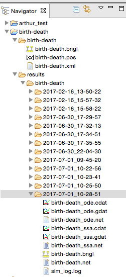

Rule-based Modeling with BioNetGen, BNGL, and RuleBender
========================================================

Description of Rule-based Modeling, BioNetGen, BNGL, and RuleBender
-------------------------------------------------------------------
# todo

BNGL and RuleBender Basic Functionality
----------------------------------------------
This section demonstrates the basic functionality of the
BioNetGen language (BNGL) and RuleBender, which is the BioNetGen IDE.

Obtain BioNetGen, RuleBender, and NFsim by following the directions at
`BioNetGen quick start <http://bionetgen.org/index.php/Quick_Start>`_.
Java and Perl must be installed.
The `BioNetGen Quick Reference Guide <https://drive.google.com/file/d/0B2lPm2_GUE01X3ZaamZxUl80NTA/view>`_
summarizes much of BioNetGen and its ecosystem in four pages.

Run RuleBender, which can:

    * Edit and save BNGL models
    * Create new BNGL models
    * Run BNGL models in a simulator
    * Print simulator debugging and logging outputs
    * Plot species population predictions generated by simulation
    * Diagram and inspect molecular types and rules

RuleBender comes with many sample models written in BNGL.
Open the birth-death model by clicking on
File -> New BioNegGen Project -> OK ->
Select a Sample -> birth-death -> Type Project Name 'birth-death_test'.

The birth-death model contains just one specie, ``A``, with no initial population::

    begin species
      A() 0
    end species

And it contains just two rules::

    birth: 0 -> A() kp1
    death: A() -> 0 km1

It's a simple model. Birth creates species ``A``, while death destroys it.
Irreversible rules have the form::

    rule_name: reactants -> products forward_rate_law

Reversible rules have the form::

    rule_name: reactants <-> products forward_rate_law, reverse_rate_law

The null (``0``) reactants and products in these rules allow
``A`` to be created from nothing and destroyed without a trace.
These rules aren't mass balanced, of course, but ignore that for now.

Simulate the model. Both ODE and SSA solvers are run, each for 50 seconds::

    saveConcentrations()
    simulate({suffix=>"ode",method=>"ode",t_end=>50,n_steps=>500})
    resetConcentrations()
    simulate({suffix=>"ssa",method=>"ssa",t_end=>50,n_steps=>500})

*Before* you look at the results, try to answer these questions:

    * What population do you expect the model will predict for ``A``?
    * How do you expect the population to vary over the 50 sec for the ODE and SSA models?

Now look at the results by clicking on the ``birth-death_ode.gdat`` and ``birth-death_ssa.gdat`` and
tabs.
Did you anticipate the model's predictions?

The ODE solver predicts that the population of ``A`` grows smoothly and rises asymptotically to 50.
(The y-axis label says 'Concentration', but it should say 'population'.
The model doesn't have a volume, so it cannot calculate concentration.)

Does this make sense?
The system reaches equilibrium when ``A`` is created at the same rate that it is destroyed.
In equilibrium, :math:`dA(t)/dt = 0`.
The ``birth`` rule creates :math:`A` at the constant rate of ``kp1`` or 10/sec.
And the ``death`` rule destroys the existing :math:`A` at a rate of ``km1`` or 0.2 of per second.
In this continuous ODE model, the quantity of :math:`A` is then given by

.. math::

    A(t) = 10t - 0.2 A t

Taking the time derivative and setting it equal to 0, we get

.. math::
    0 = 10 - 0.2 A

whose solution is :math:`A = 50`, as predicted by the ODE solver.

Note that ODE integrators approximate species populations (or concentrations)
as non-negative real numbers, whereas populations are really
non-negative integers. You can visualize this
in RuleBender by zooming in on the
``birth-death_ode.gdat`` plot. Select a rectangle of the plot from upper-left to lower-right
to see the smooth, real-valued predictions.

.. image:: ode-simulation-zoomed.png

Look at SSA's predictions for the population of ``A``. What happens when you
greatly increase the simulation's end time (``t_end``)?

Zooming in shows that SSA predicts the population as a non-negative integer
at each sampled time step.

.. image:: ssa-simulation-zoomed.png

You can find the raw inputs and outputs for each simulation run in the results subdirectory
of the ``birth-death`` project.

Raw predictions are in ``cdat`` files. Data for the above plot are in ``birth-death_ssa.cdat``::

    3.860000000000e+01  5.100000000000e+01
    3.880000000000e+01  5.300000000000e+01
    3.900000000000e+01  5.300000000000e+01
    3.920000000000e+01  5.300000000000e+01
    3.940000000000e+01  5.600000000000e+01
    3.960000000000e+01  5.500000000000e+01
    3.980000000000e+01  5.500000000000e+01
    4.000000000000e+01  5.500000000000e+01
    4.020000000000e+01  5.300000000000e+01
    4.040000000000e+01  5.300000000000e+01
    4.060000000000e+01  5.500000000000e+01
    4.080000000000e+01  5.400000000000e+01
    4.100000000000e+01  5.300000000000e+01
    4.120000000000e+01  5.300000000000e+01
    4.140000000000e+01  5.300000000000e+01

Exercises
---------
What happens when you change the rate law constants? Adjust them so the
equilibrium population is 200. Adjust them so that the model does not reach
an equilibrium. Can they be adjusted to reduce the variance of the SSA predictions?

Debugging models is easier when re-executing a simulation run produces identical output, that is,
reproduces a previous run.
Can you rename ``A`` and program RuleBender and BNGL to exactly reproduce these SSA predictions?
(I'm not aware of a way to do so.)

Molecular sites, their states, and bonds
----------------------------------------
In this section we create a new BNGL model. Follow chapter 3 of the
`Rule-Based Modeling of
Signal Transduction: A Primer <https://dl.dropboxusercontent.com/u/9028382/References/RuleBasedPrimer-2011.pdf>`_.
Make a new project
by clicking on and typing
File -> New BioNegGen Project -> OK ->
Select a Sample -> ``template.bngl`` -> Type Project Name 'signal_transduction'.
``template.bngl`` provides a template BNGL program with initialized blocks.

