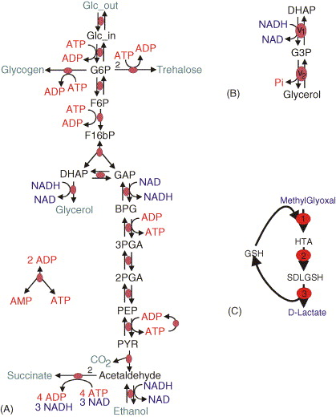

Model composition
=================
Abstraction and composition are essential strategies for building large engineered systems such as big software programs. Abstraction allows engineers to build highly functional systems with complex and sophisticated internal implementations while only exposing
the functional features that users of the systems need. The exposed features are called the system's external interface. Accessing the interface lets users obtain all the benefits of a system's sophisticated implementation without needing to understand the implementation. For example, the Python collection data structures like list, dictionary, and set are all built using sophisticated implementations, but Python programmers just use simple operations like insert, find and delete.

Composition of abstracted modules enables engineers to build complex systems by combining multiple parts, each of which has a simple external interface. In this way, abstraction and composition enable engineers to transform challenging high-dimensional problems into multiple, simpler lower dimensional problems. In particular, abstraction and composition enable teams of engineers to collaboratively build complex systems by enabling smaller groups or individual engineers to independently and simultaneously building individual components.

Because models are engineering software systems, abstraction and composition can also be powerful approaches to build large models. In particular, abstraction and composition can enable teams of modelers to work together to build large models by enabling smaller groups of modelers to model individual components.

Biological pathways are natural subsystems to abstract in dynamical biochemical models because they tend to interact tightly on fast timescales, and teams of microbiologists tend to focus their expertise on pathways. Furthermore, composition of models of pathways is a reasonable approximation due to the relatively fast dynamics of individual cellular pathways compared to dynamics of interactions between pathways. For example, the timescale of transcription is :math:`10^{1}` s whereas the timescale of the transcriptome, which is the timescale of the impact of RNA on translation, is :math:`10^2` s.

There are several specific motivations of building models via composition:

* Composition facilitates collaborative model design among multiple modelers by enabling each modeler to develop, calibrate, and test separate submodels. In particular, this enables each modeler to focus on a specific portion of the modeler without having to know all of the details of all of the other model components.
* Composition facilitates hybrid simulation of multiple mathematicallly distinct models. In particular, this can be a powerful strategy for modeling systems that involve either heterogeneous scales, heterogeneous amounts of scientific interest, or heterogeneous granularities of prior knowledge.
* Composition can reduce the dimensionality of model calibration by facilitating the calibration of separate subsets of models.
* Composition can reduce the dimensionality of model verification by facilitating the calibration of separate subsets of models.

Broadly, there are two types of model composition: composition of mathematically-like models and composition of mathematically-dissimilar models into hybrid or multi-algorithmic models. Mathematically-like models can be merged analytically simply by taking the union of their variables/species and equations/reactions. Mathematically-dissimilar models must be merged computationally by concurrently integrating the individual models. In addition to merging models mathematically and/or computationally, it is often also necessary to align the models to a common namespace and representation.

Model composition procedure
---------------------------
Below are the steps to merging models.

#. Align the models to a common namespace by annotate the species and reactions using common ontologies
#. Make all of the implicit connections among the models implicit. For example, to combine a metabolism model with a signaling model, make ATP an explicit component of the signaling model and update the effective rate constants accordingly.
#. Identify the common species and reactions among the models
#. Enumerate all emergent combinatorial complexity from the model merging
#. Align the assumptions, granularity, and mathematical representation of the models

    #. Align the assumptions of all of the models. This is typically challenging to do because the assumptions underlying models are rarely explicitly stated.
    #. Align the granularities of all common species and reactions    
    #. Convert all models into explicit time-driven models. For example, convert Boolean models into stochastic models by assuming typical time and copy number scales.
    
#. Mathematically and/or computationally merge the models

    #. Merge all of the mathematically-like models analytically by computing the unions of their species and reactions. For example, ODE models can be merged by taking the union of the state variables and summing the differentials across the models.
    #. Computationally merge the groups of mathematically-dissimilar models by concurrently integrating the models (see the multi-algorithm simulation tutorial).
    
#. Calibrate the combined model. Potentially this could be done be reusing the data that was used to calibrate the individual models. However, this data is rarely published.
#. Validate the combined model. This could also potentially be done using the same data that was used to validate the individual models. However, this data is rarely published.

Unfortunately, it is often challenging to merge published pathway models because published models are often not sufficiently annotated to understand the semantic meaning of each species and reaction and every assumption, because published pathway models often ignore important connections among pathways by lumping them into effective rate constants, and because published pathway models are often calibrated to represented different organisms and environmental conditions. Furthermore, only a few pathways including metabolism, signaling, and cell cycle regulation have good dynamic models that would be useful to merge into whole-cell models.

Instead, we recommend building whole-cell models by designing submodels from scratch explicitly for the purpose of model composition. This ensures that models are described using compatible assumptions, namespaces, granularities, and mathematical representations and calibrated to represent a single common organism and environmental condition.

Software tools
--------------
Several software tools have been developed to help researchers merge models and simulate merge models.

* Model merging: The tools below help users merge models. However, these tools only help users carryout the simplest model merging tasks, namely annotating the semantic meaning of model components and identifying common model components. These software programs do not help models carryout the more complicated tasks of resolving inconsistent assumptions and granularities and recalibrating models.

    * semanticSBML: helps users annotate models and identify common elements
    * SemGen: helps users annotate models and identify common elements

* Numerical simulation of composite multi-algorithmic models

    * E-Cell: multi-algorithmic simulator that uses a nested simulation algorithm
    * iBioSim: implements a hierarchical SSA algorithm that can simulate a specific class of merged stochastic models
    * COPASI: partitions a biochemical network into a high particle count subnet simulated by ODE and a low particle count subnet simulated by SSA

Exercises
---------

Merging metabolic models
^^^^^^^^^^^^^^^^^^^^^^^^
In this exercise, you will learn how to merge models by working through the nuances of merging two separately published models of glycolysis (A) and glycerol synthesis (B).

#. Read the papers which describe the individual models

    * `Cronwright et al., 2002 <http://doi.org/10.1128/AEM.68.9.4448-4456.2002>`_
    * `Teusink et al., 2000 <10.1046/j.1432-1327.2000.01527.x>`_
    
#. Obtain the original models from `JWS online <http://jjj.biochem.sun.ac.za/>`_

    * `Cronwright model <http://jjj.biochem.sun.ac.za/models/cronwright/>`_
    * `Teusink model <http://jjj.biochem.sun.ac.za/models/teusink/>`_
    
#. Identify the common species and reactions among the models
#. Merge the corresponding variables and equations
#. Compare your merged model with `our solution <https://github.com/KarrLab/intro_to_wc_modeling/tree/master/intro_to_wc_modeling/cell_modeling/model_composition.py>`_
#. Simulate the individual and merged models
#. Compare the predictions of the individual and merged models. You should see results similar to those below.

    .. image:: merged-model.png

#. Read this paper which describes an even larger merged model that includes a third submodel: `Snoep et al., 2006 <https://doi.org/10.1016/j.biosystems.2005.07.006>`_

Merging electrophysiological models
^^^^^^^^^^^^^^^^^^^^^^^^^^^^^^^^^^^
In this exercise. you will learn how to merge models by working through the nuances of merging three separately published models of the electrophysiology, calcium dynamics, and tension development of cardiac myocytes.

#. Read the papers which describe the merged model

    * `Terkildsen et al., 2008 <https://doi.org/10.1113/expphysiol.2007.041871>`_
    * `Niederer et al., 2007 <http://dx.doi.org/10.1529/biophysj.106.095463>`_
    * `Neal et al., 2015 <http://doi.org/10.1371/journal.pone.0145621>`_
    
#. Read the papers which describe the original models

    * `Pandit et al., 2001 <http://dx.doi.org/10.1016/S0006-3495(01)75943-7>`_
    * `Hinch et al., 2004 <http://dx.doi.org/10.1529/biophysj.104.049973>`_
    * `Niederer et al., 2006 <http://dx.doi.org/10.1529/biophysj.105.069534>`_

#. Obtain the original models in CellML format from the `CellML model repository <https://models.cellml.org>`_

    * `Pandit model <https://models.cellml.org/exposure/ea62c9c8a502afe364350d353ebf4dd5/pandit_clark_giles_demir_2001_endocardial_cell.cellml/view>`_
    * `Hinch model <https://models.cellml.org/exposure/8e1a590fb82a2cab5284502b430c4a4f/hinch_greenstein_tanskanen_xu_winslow_2004.cellml/view>`_
    * `Niederer model <https://models.cellml.org/exposure/97fb1de5199b1a74c89281db97aecc13/niederer_hunter_smith_2006.cellml/view>`_
    
#. Identify the common species and reactions among the models by annotating the model components against a single namespace
#. Merge the corresponding variables and equations
#. Simulate the merged model
#. Compare your simulation results to those reported in Terkildsen et al., 2008; Niederer et al., 2007; and Neal et al., 2015.
