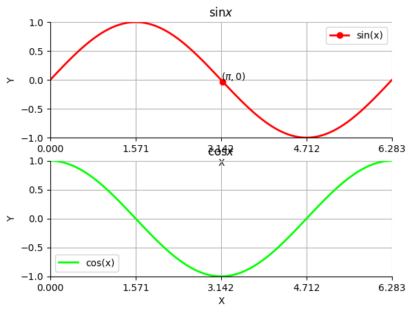

Plotting data with ``matplotlib``
=================================
``matplotlib`` is one of the simplest and popular plotting libraries for Python. The following example which produces the line plot shown below illustrates the basic functionality of ``matplotlib``:

.. literalinclude:: ../../../intro_to_wc_modeling/software_engineering/matplotlib_example.py
    :language: Python
    :lines: 9-89

Plot types
----------
In addition to line plots, ``matplotlib`` provides functions to create a wide range of plots

* ``bar``: vertical bar plot
* ``barh``: horizontal bar plot
* ``errorbar``: plots lines with error bars
* ``fill``: filled polygons
* ``hist``: 1-D histogram
* ``hist2d``: 2-D histogram
* ``scatter``: scatter plot

See the `matplotlib documentation <https://matplotlib.org/api/axes_api.html#plotting>`_ for a complete list of the available plot types.